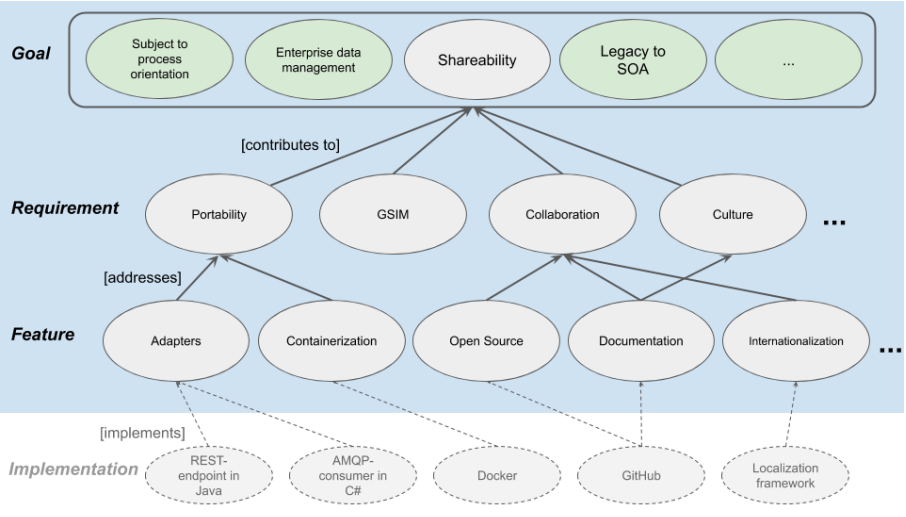
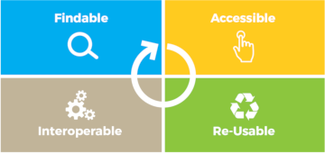

# Shared Statistical Methods

#### Background

Over the years, initiatives like __CSPA__ (UNECE), __ESSNet SCFE (Sharing common functionalities)__, __ESSnet I3S (Implementing Shared Services)__ have all tried to solve the problem of sharing statistical services across countries. Sharing is hard, and there are many hurdles to be crossed. Many of those hurdles are technical, organizational and cultural. 

One area that usually have a lot of focus is the area around _Statistical Methods Implementations)_. These are being promoted f.ex. through _The awesome list_ (link), and are increasingly released to the public domain through various _Open Source_ licenses. 

The challenge is still that these _Statistical Methods_ some times lack the software craftmanship of other types of modern software. The methods themselves are from a methodology perspective of very high quality.  From a software perspective, things like non-functional requirements, portability, testability etc. are not always taken into account. CSPA 2.0 tried to lay out a path for adresseing some common software architectual issues surrounding services in general. 

Some things have changed dramatically over the last 5-10 years though. The adoption of _Open Source_ in Statistical offices have increased. The willingess to share code have also increased, and with that a more open and collabarative environment. 

#### Statistical Methods

_Statistial Methods_ are in this document losely defined as a collection of algorithms expressed in software and used in a Statistical Production. [Citation needed.. :-)].

Software like JDMetra and TauArgus are great tools for Seasonal adjustment and Discloure Control and have been widely adopted. Both are Open Source, and especially JDMetra is greatly supported, and have a relativley active development community. TauArgus is being supported, but is lacking out-of-the-box multi-plattform support. 

Both software packages (and this is based on it's current releases) could be more modular, and have a greater split between user-interface and the actual service they provide. 

#### The problem

Some of the areas ESSNet I3S explored was techniques related to automating builds, packaging and continous deployment, but also best practices around software design, so we are able to create services that can be used by NSI's regardless of technology plattforms. There are fundamentally two areas where software and services which can help increased access to software, and better integration. One is the area around building and deploying software, and the other are is the software architecture itself. We have issues with a lot of existing Statistical Methods in the Open Source community that lacks in both areas. For the software architecture side, CSPA 2.0 describes different aproaches that can make software more shareable. Examples of software architecture principles are things like [SOLID](https://en.wikipedia.org/wiki/SOLID)-principles that should be considered. The lack of attention to these to areas is increasingly at odds with the way modern, cloud native computing is done, and makes it harder to utilize otherwize great quality Statistical Methods.  

#### The solution

In the Data science world, there are principles like [FAIR](https://en.wikipedia.org/wiki/FAIR_data). Although these principles are used for data, it could also be used as a guiding principle for Statistical Method Implementations:

We propose to add to each of these principles how one should go about handling the stewardship of Statistical Method implementations. The proposal is to focus on one or two use cases related to specific Statistical Methods implementation like __TauArgus__ f.ex., where we would contribute and help to implement things like automated builds, deployments and test. And maybe even suggest best of breed software engineering principles when designing _Statistical Methods_. Here we would use all the experience we have accumulated through the work on CSPA, ESSNet SCFE & ESSNet I3S and apply them to increase the technical quality of the software that have a lot of users in the Statistical community. One result of this work could also be a set of technical quality criterieas that could be used to asses Statistical software that is show cased in the list of [_Awesome official statistics software_](https://github.com/SNStatComp/awesome-official-statistics-software).