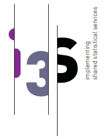

# I3S ESSnet

The Implementing Shared Statistical Services ESSnet aims at fostering the development and reuse of statistical services accross the ESS.

This repository is also published [in HTML](https://i3s-essnet.github.io/Documents/).

The following documents and pages are available:

  * Meetings
    * [Kick-off meeting](ko-meeting/index.md)
	* [Rome hackathon](rome-hackathon/agenda.md)
  * Work packages
    * [WP1](wp1/README.md)