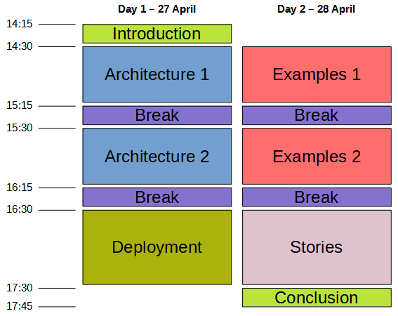

# I3S ESSnet Final meeting draft agenda

The final workshop of the I3S ESSnet will take place online on the afternoons (CET) of 27 and 28 April 2021.

## Day 1, April 27th
 
### [14:15-14:30] Welcome and introduction (resp. FR)

Overview of the ESSnet, structure and organisation of the meeting.

Welcome address by Mr Emanuele Baldacci (Eurostat).

### [14:30-16:15] Session 1 - Architecture (resp. SE)

Presentation of Work Package 2 results with Matjaz Jug as discussant. 

#### [14:30-15:15] "Why and What" - Business drivers and concepts for the architecture guidance. 

#### [15:15-15:30] Break

#### [15:30-16:15] "How" - A description of how to implement the architecture and a presentation/demo of the "cookbook" (ie code examples)

### [16:15-16:30] Break

### [16:30-17:30] Session 2 - Deployment (resp. NO)

Presentation of Work Package 3 results.

## Day 2, April 28th

### [14:30-16:15] Session 3 - Examples (resp. IT)

Presentation of Work Package 1 results.

Implementing new services from existing solutions

#### [14:30-15:15] Part 1

  * [15 min] ARC 
  * [10 min] Relais
  * [10 min] PXWeb
  * [10 min] VTL Tool

#### [15:15-15:30] Break

#### [15:30-16:15] Part 2

Service reuse and lessons learnt

  * [15 min] Istat reusing ARC service
  * [10 min] Insee reusing Relais service
  * [10 min] PXWeb reuse cases
  * [10 min] Lessons learnt

### [16:15-16:30] Break

### [16:30-17:30] Session 4 - Success stories (resp. PT)

Presentation of Work Package 4 results.

### [17:30-17:45] Conclusion (resp. FR)
