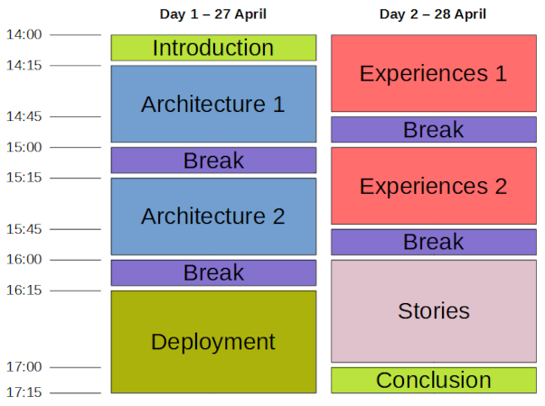

# I3S ESSnet Final meeting draft agenda

The final workshop of the I3S ESSnet will take place online on the afternoons (CET) of 27 and 28 April 2021.

## Day 1, April 27th
 
### [14:00-14:15] Welcome and introduction (resp. FR)

Overview of the ESSnet, structure and organisation of the meeting.

### [14:15-16:00] Session 1 - Architecture (resp. SE)

Presentation of Work Package 2 results - Discussant: Matjaž Jug 

#### [14:15-15:00] "Why and What" - Business drivers and concepts for the architecture guidance. 

#### [15:00-15:15] Break

#### [15:15-16:00] "How" - A description of how to implement the architecture and a presentation/demo of the "cookbook" (ie code examples)

### [16:00-16:15] Break

### [16:15-17:15] Session 2 - Deployment (resp. NO)

Presentation of Work Package 3 results - Discussant: Joni Karanka

#### [16:15-16:20] Introduction

#### [16:20-16:45] Live demo (Establish platform and implement service(s))

#### [16:45-17:00] Lessons learned

#### [17:00-17:15] Discussion and questions

## Day 2, April 28th

### [14:00-15:45] Session 3 - Experiences (resp. IT)

Presentation of Work Package 1 results - Discussant: Tomaz Speh

Implementing new services from existing solutions

#### [14:00-14:45] Part 1

  * [15 min] ARC 
  * [10 min] Relais
  * [10 min] PXWeb
  * [10 min] VTL Tool

#### [14:45-15:00] Break

#### [15:00-15:45] Part 2

Service reuse and lessons learned

  * [15 min] Istat reusing ARC service
  * [10 min] Insee reusing Relais service
  * [10 min] PXWeb reuse cases
  * [10 min] Lessons learned

### [15:45-16:00] Break

### [16:00-17:00] Session 4 - Success stories (resp. PT)

Presentation of Work Package 4 results - Discussant: Taeke Gjaltema

How to enhance service reuse

  * [15 min] Survey results 
  * [15 min] New approach on available service awareness
  * [15 min] Communication kit
  * [15 min] Discussion on communication

### [17:00-17:15] Conclusion (resp. FR)

Concluding remarks by Mr Emanuele Baldacci (Eurostat).
