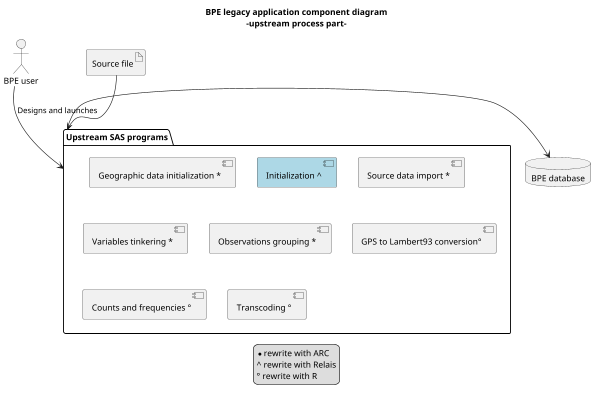
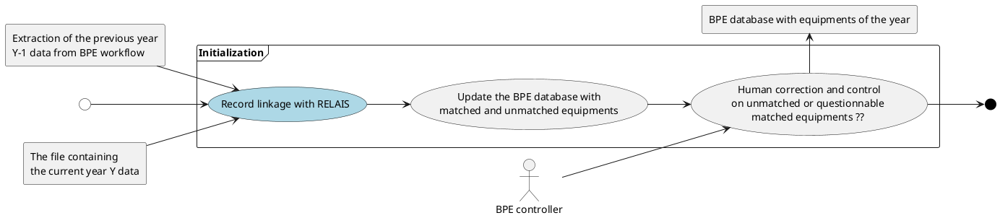

# Lessons learned
## Insee reusing RELAIS service

- Presenters: Franck Cotton & Manuel Soulier, Insee

---

## Context overview

- BPE
	- ... stands for "equipment permanent database"
	- ... keeps an up-to-date stock of public French facilities ("équipments")
	- ... is an Insee legacy application from the 2000s that is to be refactored

---

## AS-IS architecture

- The business team had to 
	- re-appropriate the different stages of the BPE production process
	- define a re-engineering roadmap for renovating the information system

---

## TO-BE architecture

- "Initialization" consists of integrating the new annual facilities files into the database in a consistent manner
	- despite the lack of identifiers and inconsistencies of data from one year to another
- Use RELAIS record linkage to identify which facilities must be removed, kept or added to the database

  

---

## Version used and business cases

- The new RELAIS version provided with the IS2 workbench is used
	- Insee’s technical reference framework compatibility
	- The BPE project owner is really convinced by the IS2 workbench
	- A workflow including ARC, RELAIS, VTL in the same IS2 workbench would cover almost all BPE use cases

- 3 business case scenarii
	- case 1: "probabilistic", case 2: "performance", case 3: "workflow"

- For each scenario
	- Select the businesss files
	- Compare RELAIS outputs and BPE legacy application results

---

## Case 1 "probabilistic"

- Objective
	- Evaluate the probabilistic record linkage based on the Fellegi-Sunter method

- Results
	- Probabilistic record linkage results with RELAIS are really promising
		- Comparaison with legacy BPE results - **including a human correction activity** -
		- +63 matches out of 1272 (+5%), 4 false matches out of 1339 (0.3%), due to the questionable choice of using a Jaro-Winkler distance to compare groups of words
	- Great reactivity of Istat developers and methodologists on the [GitHub repository](https://github.com/mecdcme/is2) issues

- Next steps 
	- training sessions, methodological lessons & support
	- GUI improvements to give more information about the status of linkage process
	- for modularity sake, make RELAIS and IS2 independant with their own repositories

---

## Case 2 "performance"

- Objective
	- Evaluate the performance of RELAIS for large files

- Results
	- RELAIS implements space reduction methods which improve a lot the processing time on large files
	- files with ~100,000 records may be processed by RELAIS with 16 MB of RAM
	- Larger files makes both the GUI and the application engine crash
	- Istat warned early in the project of this known limitation, so this was expected

- Next steps 
	- RELAIS functionalities are perfect matches for BPE, but performance still a sticking point
	- Architecture work on data access and roadmap

---

## Case 3 "workflow"

- Objective
	- Reuse RELAIS outputs as inputs to other IS2 services such as data visualization, ARC...

- Results
	- Use case not totally completed but it has been proved to work
	- IS2 users might retrieve the outputs produced by the services as files
	- Management of multiple files is not production-ready

- Next steps 
	- Architecture work on data access and roadmap

---

## Conclusions

- Reusing RELAIS led to reengineer monolithic application into a service oriented architecture
- RELAIS gives very interesting results, comparable to what a humain is able to do in term of record linkage
	- despite remaining points to correct
- Great collaboration between Istat and Insee
	- methodological trainings, and support
	- cross-contributions to enhance IS2 and RELAIS
- ... to be continued by working on data architecture and agreeing on a roadmap (work in progress)

---

THE END

---
