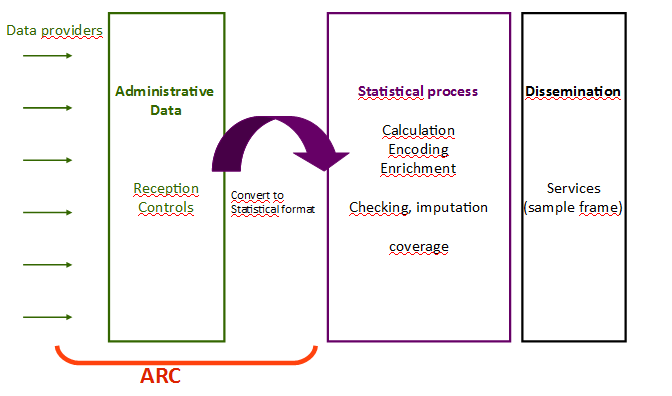
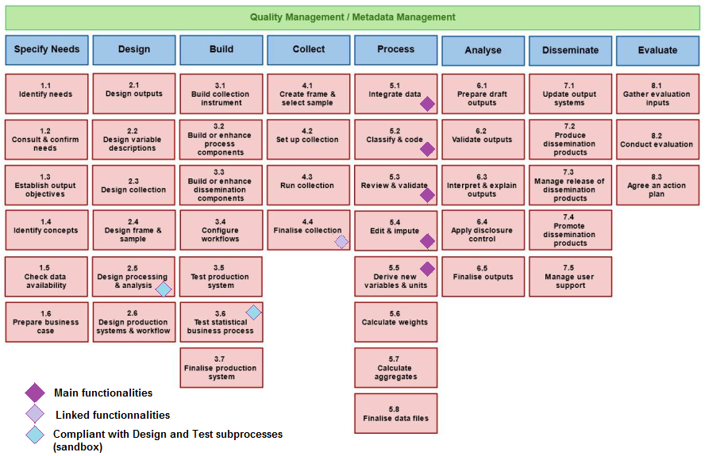

# I3S ESSnet - Description of the ARC service

This document describes in detail the 'ARC' service developed by Insee. This service implements extended functionalities for integrating administrative data into statistical processes. The description is organized according to the AAA (Attractiveness, Achievability, Affordability) framework defined by the "Sharing Common Functionalities" ESSnet.

# Attractiveness

## Contribution to statistic objectives

A statistical process generally includes a data acquisition phase. Multiple sources, and the more and more frequent combination of them, can provide these data (survey, administrative or private data). A conversion phase to statistical units and attributes is necessary before statistical treatments can be applied.

The ARC (from the French: Acquisition - Réception - Contrôles) software allows to receive (administrative) data supplied by the providers (several formats are supported, particularly XML), to control the compliance of the received files, and to transform administrative data to elementary statistical data. The software enables the statistician to define and apply controls and mappings, to test them in a sandbox environment (linked to the software), and to put them into production without frequently calling on a developer.

These functionnalities/services aim the statistician’s independence and ability to adapt to the data evolutions, thereby avoiding impacts on the statistical chain.

## Confidence in benefits

### GSBPM mapping

The Generic Statistical Business Processes Model (GSBPM 2018) presents the processes that may be followed by the National Statistics Institutes (NSIs) to produce statistical outputs.  It provides a standard framework and harmonised terminology to  help statistical organisations to modernise their statistical production processes, as well as to share methods and components. The GSBPM can also be used as a template for harmonizing statistical computing infrastructures: for this reason, we describe here a simple mapping of th ARC application functionalities to the GSBPM phases and sub-processes.

The main functionalities of the ARC application related to the data processing life cycle are linked to the GSBPM "Process" step, and more precisely to elementary treatments necessary to integrate data, engage basic cleaning and editing tasks, but also transformation operations that are necessary to convert raw data into a statistical database compliant with statistical concepts and units. This is mainly related to sub-processes going from "5.1 - Integrate data" to "5.5 - Derive new variable and units":

  - Sub-process "5.1 - Integrate data" is related to data integration from one or more sources. According to GSBPM, the input data can be from a mixture of external or internal data sources, and a variety of collection modes, including extracts of administrative data. The result is a set of linked data. ARC is dedicated to combining data from multiple sources or combining multiples files from a same kind of data source, in order to create an integrated database.
  - Sub-process "5.2 - Classify and code" is also covered by ARC, as it includes coding routines to convert initial variable codes to a pre-determined classification scheme.
  - Sub-process "5.3 - Review and validate" examines data to try to identify potential problems, errors and discrepancies such as outliers, item non-response and miscoding. The ARC user can create testing and validating rules, which will be applied to the data with detection of actual or potential errors. According to GBSPM, treatments in sub-process 5.3 are only dedicated to discrepancy and error detection, while effective data editing is done in sub-process 5.4.
  - Sub-process "5.4 - Edit and impute" convers a variety of updates, often using a rule-based approach. In ARC, data editing is mainly related to filtering and basic imputation. Functionalities include  the determination of whether to add or change data, changing data values, and flagging data as changed in the process phase.
  - Sub-process "5.5 - Derive new variables and units" derives data for variables and units that are not explicitly provided in the collection, but are needed to deliver the required outputs. Through user defined rules, ARC may derive new variables by applying arithmetic formulae to one or more of the variables that are already present in the dataset, or applying different model assumptions. 
    
Previously to theses steps, ARC is also built to host raw data files that have been collected and deliver environment for storing large data collection before being processed. It thus can be used as a collection tool according to GBSPM sub-process "4.4 - Finalise collection", loading the collected data and metadata into a suitable electronic environment for further processing.

Because it includes sandbox creation and testing procedures of user rules, ARC application is also  compliant with GSBPM subprocesses dedicated to "2.5 - design processing" and "3.6 - test statistical business process".

  - "2.5 - design processing" can include specification of routines for coding, editing, imputing, estimating, integrating, validating and finalizing data sets.
  - "3.6 - test statistical business process", which includes activities to manage a pilot the statistical business process, including testing processing rules on data.

If the ARC service is selected by the I3S ESSNet, new developments will be engaged to add functionalities that will expand the GSBPM coverage of the service to the sub-processes 5.7 ("Calculate aggregates") and 6.2 ("Validate output"), with the ability to use aggregations to perform advanced controls, filtering, or formatting, and also produce indicators and counts (see below, "iteration 3: add an aggregate module").

### Features and functional description

#### Overview

The ARC software includes functions of configuration and execution for file processing pipelines.

The processing of a file in ARC is materialized by a sequential execution of elementary services which are also called "processing modules". These modules are instantiable in disjoint execution environments called "sandboxes".

The choice, the scheduling, or the internal operations of the modules are based on user written rules defined for the chosen sandbox. ARC therefore allows the user to experiment with different processing rules for identical files in different sandboxes.

ARC provides a web interface to lead the user through the rule definitions. The language for defining complex rules is based on the SQL language.

The ARC modules treatments are performed by the database and parallelized by file at runtime.

The database keeps track of the actions of the software and allows the synchronization service to automatically rebuild a consistent system if necessary. User defined rules and metadata are stored and versioned in the database.

ARC currently supports two types of metadata:

  - The models identify the normalized relational models defined by the user; they are used to define the rules and store the output generated by the statistical formatting module.
  - The external tables integrated by the user are used by the rules of the different modules.

#### List of the ARC treatment modules

| Module Name      | Mode | Order | Description | GSBPM |
| ---------------- | --------- | ------------------------- | ----------- | ----------- |
| Synchronize | optional non-parallel | 1 | Rebuild the database and file system in a consistent state with the database.   Execute file replays or delete commands.   Copy the rules of the configuration space into the sandbox of execution so that they are taken into account in the execution of the subsequent modules |
| Register | mandatory parallel | 3 | Register a set of input files and update the file system | 4.4 |
| Identify | mandatory parallel | 4 | Apply the rules of the module to determine the "category" of the files.   The rules written by the users have a global input key called "category".   This key identifies the different chains of treatments. The category and the sandbox determines which rule sets to apply to the file when processing the subsequent modules | 5.2 |
| Load | mandatory parallel | 5 | Apply the rules of the module to instantiate the proper file reader to load the data without transformation in the database.   Store the file hierarchy of structured files as XML for the subsequent modules| 5.1 |
| Structure | optional parallel | >5 | Flatten the previously loaded structured data consistently. Apply the rules of the module for advanced structuration features | 5.1 |
| Control | optional parallel | >5 | Apply the correction and control rules | 5.3 |
| Filter | optional parallel | >5 | Apply a filter rule to exclude records| 5.4 |
| Format | optional parallel | Last mod | Transform and store loaded data in a standard user-defined data model | 5.5 |

#### Advanced features of file and data manipulations

ARC doesn't require a XSD validation  or rejection to load XML files into the database. The controls are decoupled from the loading of the data and may be implemented in the subsequent and optional control module.

The load module has the ability to convert a flat unstructured file into an XML file. The user defines the expected XML structure by the rules of the module.

The structure module flattens the loaded structured data in a consistent way. It provides advanced features such as joins between data fields, removal of duplications or block-based copy operations. 

#### The statistical formatting module as an interface for the information system

The data generated by the formatting module are stored into one of the data models chosen and built by the user.

The registered client softwares can query data and model structures through the data retrieval web service provided by ARC.

In practice, the formatting module acts as an interface between the input files and the expected model used by the client softwares. The evolutions of the input files can thus be more easily decoupled from the statistical processing carried out by the client softwares.

####  Writing the ARC user defined rules

The user sets ARC modules by writing rules:

  - simple rules to parametrize the module's operation
  - complex rules interpreting the data processed by the module

The complex rules of data manipulation or condition checking rely on the SQL language; they are checked syntactically on input. The structuring rules are written in XML.

#### From sandbox to production

Test and validation of the user-defined rules may be carried out by the user by executing the modules on the application sandboxes.

The web interface allows the user, for each sandbox, to apply his new set of rules, iterate over the modules, monitor the reports or download the data.

The implementation of modules is identical bewteen the production and the sandbox as the production environment is just defined as a particular sandbox.

The user can deploy his rules in the production environnement through the web interface. The deployed rules become effective after the invocation of the synchronize module.

#### Performances

ARC processes files in parallel. The application was originally designed to handle massive flows of moderately large files, but has been afterwards optimized to be as effective in the processing of very large files (~ 50GB).

#### Software architecture and deployment

ARC consists of a Java web application (Java 8, Tomcat 8), a Java processing server (Java 8), and a PostgreSQL database (version 9.6).

The "synchronize" Java module handles the rebuilds and the upgrades of the database according to the version of the Java code.

ARC has already been containerized with Docker. This way to deploy ARC will be supplied as part of the I3S project.

## Stakeholder commitment

Three instances of the ARC application are running in production within the Insee information system on employment and income (called "SIERA"). The main instance loads every month the 2.5 millions of income files declared by the French companies conformant to a XML format called "DSN". The other instances are used monthly to load large data files into the information system. ARC is currently under study to be deployed for the SIERA future projects and for other Insee information systems.

The internal Insee community around ARC is fairly active and its functional base is evolving at the rate of a [major version per year since 2016] (# Status-of-software). The ARC application is maintained in production by a maintenance team of 2 developers. The SIERA project team and a dedicated expert technically help the other projects to reuse ARC

In total, 6 developers from the national IT development service of Orléans are currently working on developments and supports around ARC.

Insee would mobilize 1.5 developers to integrate ARC in the ESSNET I3S project for the period 2019-2020.

# Achievability

## Confidence in delivery

### Status of software

The ARC application has been used in production statistical processes for nearly 3 years; several instances of ARC have been deployed since June 2016 in Insee IT system. The application has been strengthened year after year, through a continuous quality improvement process. 

| Version name | Purpose of the version | Start date | Release date | Features implemented |
| ------- | --- | ----- | ---- | ---- |
| v1-DSN | Monthly formatting of 2.5 million XML employee files | Jan 2015 | Jun 2016 | 1. Full pipeline for XML files   2. Optimized performance on massive flows of small files  1  |
| v2-CTS | Multisource hub for large files (50 million lines, 500 columns) | Mar 2017 | Nov 2017 | 1. Delimited flat and key-value type files loader  2. Structuration feature for flat and key-value type files   3. Parallel modules execution by file |
| v3-CTS | Performance on all file types | Jan 2017 | Aug 2018 | 1. Isolation of file pipelines   2. Optimized performance on large files  2  |
| v4 | Quality iteration | Sep 2018 | Jan 2019 | 1. Refactoring of the java classes and models   2. The processing chain is no longer static but configurable by the user |

<small> 1. The integration of 2.5 million complex XML files of up to 200 MB takes 5 days of processing </small>
<small> 2. The parallel integration of 2 files of 50 GB of data (uncompressed) or 50 million lines and 150 columns takes 10h without flat file to XML restructuration. The integration of a single file takes 8h. </small>

### Alignment with CSPA

The service was initially developed without specific considerations for its CSPA compliance or its reusability by other NSIs. However, it was natively built as a potentially shared service with other statistical processes within the French NSI: ARC was designed as an elementary building block dedicated to data integration and elementary data editing (review and control though user specified rules).

As a consequence, its design is quite independant of local technical environment (and it can be packaged as a Docker image for international deployment), but some work has still to be done in order to reach common standards such as CSPA. The following points have to be improved through the I3S ESSNet:
  - Basic code review in order to write it fully in English 
  - Advanced code refactoring so as to re-build the application as services.
  - Documentation improvements (functional and technical)
  - Release as open source

## Capacity of competence (community, FOSS)

The ARC maintenance and project team members work at the software development center of Orléans (SNDIO) and are specialized in data manipulation processes. The following tables provides information on the resource available in the team for tasks of various complexity.

| Development item | Complexity | Competence currently  available  (number of developers) |
| ---- | -- | -- |
| Standard Java web architecture  - Java 8, Tomcat 8, PostgreSQL | low | 6 |
| Simple proven technologies for web interfaces Self developped generic component to generate views - JavaScript, Ajax, Strut 2 | moderate | 6 |
| Basic Java frameworks and functionalities - Spring, Java 8 (except lambda expressions) | low | 6 |
| The code complexity may be hard because of the genericity  - especially in the structure and in the statistical format modules | high | 3 |
| Database processes are optimised and complex | high | 2 |

Both of the project and the maintenance are managed through iterative methods.

## Adequacy of ressources provision (shared, replicate, interoperable)

### Risk analysis

| Risk | Probability | Criticity | Mitigation |
| ---- | -- | -- | -- |
|The main developper will leave his position in the middle of the project | sure | severe | Train another developer as soon as possible. Focus first on the quality of the code and documentation to make the application easier to undertake. Already engaged |
| Development ressources shortage due to external simultaneous operations | likely | moderate | Break down the projet into small and consistent realeases to meet priorities. |
| Inadequation between the application used in production and the project | possible | moderate | Automate the release upgrades. The maintenance team and the application owner must validate the new functionalities and test at least one release out of two. |

# Affordability

## Implementation / operational costs

### Four development focuses for the project

1. Quality - Upgrade the code to conform with the open source collaboration level
2. Sharing - Use the development standards including the ones provided by the ESSnet to promote reusability
3. Evolution of functionalities - Extend or modify the base features to fulfill the emerging needs
4. Services and modularity - Review the design of services

### Project planning proposal

Insee proposes to break down the project into 4 iterations, each providing a new stable release of the ARC application.

The iterations are built to cover a unique developement focus among those previously mentionned. This option may improve the clarity of the releases, reduce the costs of similar developments and improve the certainty about a final delivery.

### Iteration 1: Develop an open source release

Development focus: Quality
Duration: 6 months
Start date: Feb 2019
End date: Jul 2019

| Scope | Task | From | To |
| -------- | ------ | -- | -- |
| All modules | Use English as a working language for the code, the database, the web interfaces and the documentation | in progress | Jun 2019 |
| All modules | Repackaging of Insee internal libraries | now | Feb 2019 |
| All modules | Cover the code by tests (Coveralls / Travis CI) |  Feb 2019 | Jun 2019 |

### Iteration 2: Use VTL as a language for rule definition

Development focus: Sharing
Duration: 6 months
Start date: Jul 2019
End date: Dec 2019

| Scope | Task | From | To |
| -------- | ------ | -- | -- |
| Load, Structure | Serialize the storage of the hierachy of JSON or XML structured files | Jul 2019 | Sep 2019 |
| Load | Add standard implentations to loader   (JSON, Read XML attributes) | Jul 2019 | Sep 2019 |
| All modules | Interface the user-defined rules with VTL | Sep 2019 | Dec 2019 |
| Register Meta Data | Add features for remote file repositories | Sep 2019 | Nov 2019 |
| All modules | Delivery by Docker container | Nov 2019 | Dec 2019 |

### Iteration 3: Add an aggregation module

The addition of an optional aggregation module simultaneously addresses two distinct business needs:
1. Produce indicators and countings
2. Use aggregations to perform advanced controls, filtering, or formatting

The aggregation module would expand the GSBPM coverage of ARC to the GSPBM 5.7 and GSPBM 6.2 sub-processes.

Development focus: Evolution of functionalities
Duration: 2 months
Start date: Jan 2020
End date: Feb 2020

| Scope | Task | From | To |
| -------- | ------ | -- | -- |
| <new module> Aggregate| Implement user defined aggregates | Jan 2020 | Feb 2020 |

### Iteration 4: Generalize the context variables used by the modules

Item: Services and modularity
Duration: 8 months
Start date: Apr 2020
End date: Nov 2020

| Scope | Task | From | To |
| -------- | ------ | -- | -- |
| All modules | Review of the existing services Check the entry level of the concepts | Apr 2020 | Nov 2020
| Identify | Generalize the context variables used by the modules | Apr 2020 | Nov 2020 |

## Alternatives certainty

## Legal compliance

Licencing for Open Source