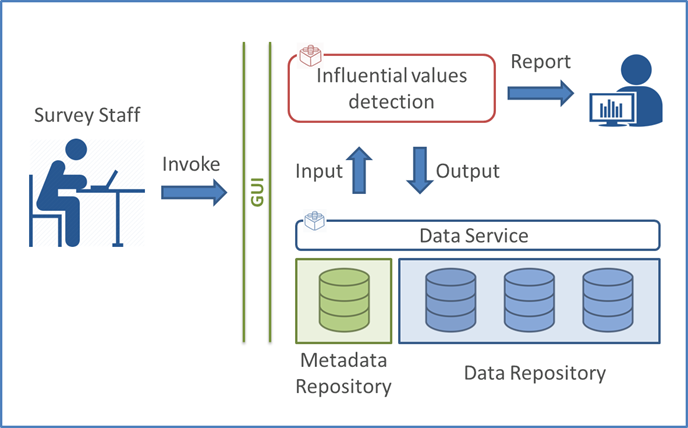

# Outlier detection

**DO**: Istat

**RO**:

**Rank**: 14

**Functionalities mapped to the GSBPM**: 5.4 Edit & impute

**State of achievement**: Selemix Version 1.0

**Distance to CSPA**: compliant with CSPA principles

**Technical prerequisites**: R, Java

**Risks**: -

**Description**: This service allows to identify and rank influential units that impact the final estimates (selective editing). 
Based on the wrapping of the generalized software Selemix, written in R and available at: https://www.istat.it/en/methods-and-tools/methods-and-it-tools/process/processing-tools/selemix, this service aims to reduce the number of manual revisions and will  offer the main functions available in Selemix: ml.est, pred.y, sel.edit. The user will be able to select a function and set the parameters for data processing. For each function, specific reports will summarize the results, as shown in the following figure.

The proposed service is not a simple GUI wrapping of an R package. More specifically, to execute the ‘outlier detection’ process steps, a metadata-driven architecture has to be designed and implemented. As shown above, a user invokes the statistical service, that runs the procedure by accessing metadata and input data. At the end of the procedure, output data and metadata are stored in a repository and reports are displayed to the user. 
