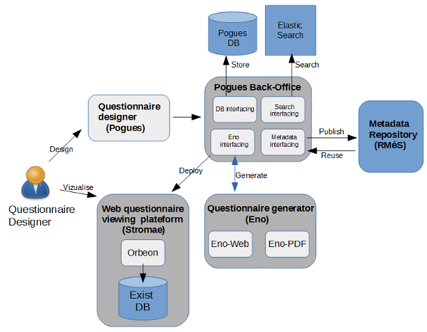
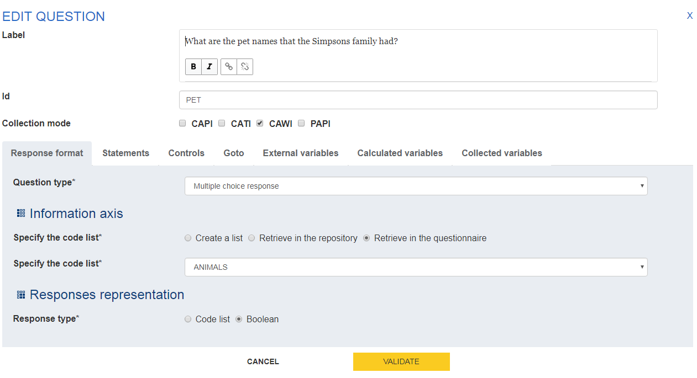
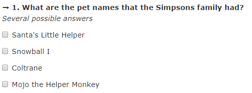
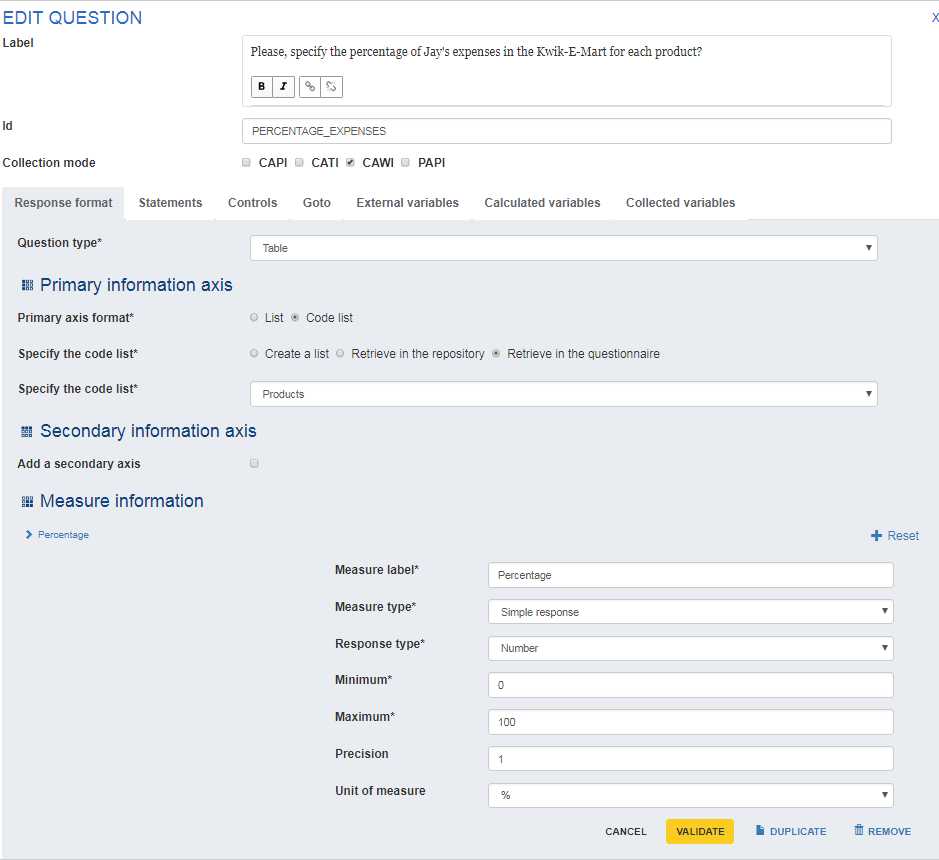
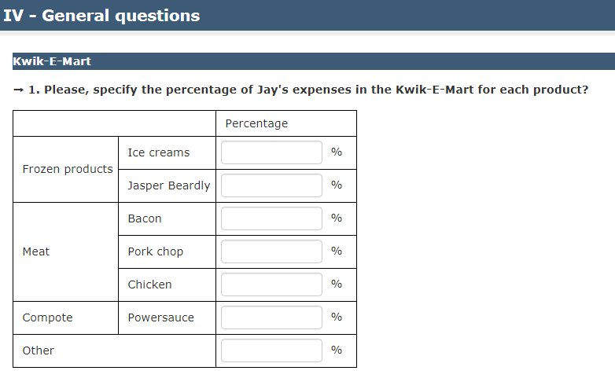

# Questionnaire design

**DO**: Insee

**RO**: Istat

**Rank**: 8

**Functionalities mapped to the GSBPM**: 2.3. Design collection

**State of achievement**: Released version 1.0

**Distance to CSPA**: available as CSPA-compliant service

**Technical prerequisites**: JavaScript

**Risks**: -

**Description**: As part of the overhaul of its survey data collection platform, Insee has invested important resources during the last few years in the development of a visual questionnaire design tool, named Pogues. With this tool, the survey managers can very quickly design their questionnaires in a full WYSIWYG way, and export the result as DDI or PDF. Pogues was created as a companion tool of the Eno questionnaire generation service that was successfully proposed for reuse in the SCFE ESSnet. It is already available under different packagings, including a containerized version. Note that Pogues could also be seen as a Web questionnaire visualisation service (number 10 in the SCFE list).

Eno and Pogues are part of a very complete ecosystem that also contains various back-office services, a platform for collecting survey data from generated questionnaires, and a metadata repository. (RMéS) allowing the management of the DDI descriptions of the questionnaires or their constituents (variables, code lists, etc.). In order to avoid any technical dependency that would hinder the possibilities of reuse of Eno and Pogues, all the links between the different components have been implemented as web services.

The process of creating a questionnaire is thus divided into several blocks (see diagram below), in particular:

  - the graphical interface for specifying a questionnaire: Pogues (object of the service).
  - a back-office chain to manage the persistence of the Pogues specifications as well as the communication with the RMéS repository, and to invoke Eno for the generation of the questionnaire.
  - the Eno generator itself, which is available in two packagings: web service and application on the command line.

The generated questionnaires can be of serveral types:

  - web forms in XForms format, ready to run on servers like the [Orbeon Server](http://www.orbeon.com/) engine (the possibility of running the forms on clients with libraries like [XSLTForms](http://www.agencexml.com/xsltforms.htm) has not been tested).
  - paper questionnaires in PDF.
  - questionnaire specifications in desktop format (Open Document), which describe precisely the questionnaire and can thus be used to implement them in formats that are not directly supported (e.g. Blaise).
  - (in development) JavaScript/React components to include in a client application.
  

It should be noted that the Pogues application is open source. Developments are conducted on the [GitHub](https://github.com/InseeFr/Pogues) software development platform.

### Description of a questionnaire

The purpose of this literary presentation of the questionnaire object is not to be exhaustive but is rather as an aid to understanding the features of the Pogues application.

A *questionnaire* is composed of one to several so-called sequences of level 1. Each level 1 sequence can contain one to several so-called sequence level 2 sequences. It is not envisaged to go to a level of greater depth. Each sequence (level 1 or 2) can contain 0 to several *questions*.

A sequence or a question can contain 0 to several declarations, 0 to several controls and 0 to several redirects.

A *declaration* is a neutral term designating a textual element of the questionnaire accompanying a sequence or a question (other than a question wording, response modalities ...). A declaration can be of type: comment, instruction, help, or warning.

A *control* allows, according to the expression of a condition, to control the quality of the input in the questionnaire generated. It is characterized by a condition on one (or more) variable(s), an error message and a criticality level.

A *redirection* allows, according to the expression of a condition, to hide or to display certain sequences or questions of the questionnaire. It is composed of a condition on one (or more) variable(s), a target (sequence or question) to jump to if the condition is verified and / or another target if the condition is not verified.

In addition, a question must have one to several *answers*. An answer can be of different types (numeric, text, date, list of modalities) and take different forms of presentation (drop-down list, checkbox, radio button, auto-completion, table).

A *collected variable* refers to a statistical variable collected in the questionnaire for the purpose of the survey. A response is associated with a collected variable.

An *external variable* refers to a variable not collected in the questionnaire, but useful for personalization. For example, it can be a date to display in the wording of a question. External variables are attached to the questionnaire.

A *calculated variable* is a variable calculated from other variables, including other calculated variables. The calculated variables are attached to the questionnaire.

### Pogues main functionalities

The Pogues user interface is an application that aims to allow a questionnaire designer to be able to specify his questionnaire (both questionnaire semantics and ergonomics) and then visualize the web or paper questionnaire immediately.

The main features (or macro-functionalities) of Pogues are:

  - Authenticate a user;
  - Manage a questionnaire (create a questionnaire, edit an existing questionnaire);
  - Manage the structure of the questionnaire (sequences and questions);
  - For each sequence or question:
    - Manage the declarations;
    - Manage redirects;
    - Manage controls;
  - For each question:
    - Manage answers;
    - Manage variables;
  - View the web questionnaire produced by the back-office chain;
  - Save a questionnaire.

### Technologies used

  - Web application: JavaScript ES6, HTML 5 and CSS3.
  - JavaScript libraries: The React and Bootstrap libraries are used. The Pogues application also uses the [Redux](http://redux.js.org/) framework.
  - JavaScript dependency management: [npm](https://www.npmjs.com/)
  - Persistence: a database ensures the persistence of JSON data to save the questionnaire being edited in Pogues. The user can thus interrupt his work and resume it later. Communication with this database is via web services.
  - Exchange with the back office: ReST web services.

### Examples

The following screenshots give examples of questions as specified in the Pogues UI and their correspondence in the generated web questionnaire.

#### Multiple choice question

  - In Pogues

  

  - Generated

  

#### Table

  - In Pogues

  

  - Generated

  

For an example of a complete questionnaire, and to test the application, please visit the [Pogues demo platform](http://pogues.scfe.eu/rmspogfo/#/questionnaire/i6vw21).