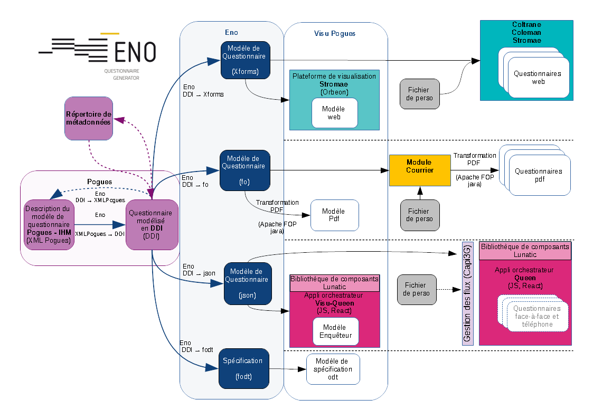

# VTL Tools

## Introduction and use case

Insee's questionnaire factory overview

Specifying questions requires some script language (logic flow, variables)

Example of a question [specification](http://pogues.scfe.eu/rmspogfo/#/questionnaire/k07w61mf) and [rendering](http://stromae.scfe.eu/rmesstromae/fr/esa-dc-2018/questionna/new?unite-enquete=123456789):

Example of [complex questionnaire](http://pogues.scfe.eu/rmspogfo/#/questionnaire/simpsons) with controls.

Controls are currently specified in a custom XPath-like language that we want to replace by VTL. We need:

  * JavaScript VTL editor to include in Pogues for the specification of controls
  * A JavaScript VTL interpretor for the rendering next generation of CAPI questionnaires

For the transition:

  * Eno needs to translate XPath controls into VTL for Lunatic
  * We might need to translate from VTL to XPath for the current XFomrs platform

*Nota bene:* our needs are limited to simple validation expressions on scalars.

## VTL Tools in JavaScript

  * Leverage on components generated from the formal grammar by Antlr
  * Open source on Insee's [GitHub repository](https://github.com/InseeFr/VTL-Tools)
  * Integration pipeline with [Travis-CI](https://travis-ci.org/InseeFr/VTL-Tools) and [Coveralls](https://coveralls.io/github/InseeFr/VTL-Tools)

### The editor

Inclusion of VTL in the [Lunatic editor](https://inseefr.github.io/Lunatic/editor).

### The interpretor

  * [Functional coverage](https://inseefr.github.io/VTL-Tools/en/coverage.html)