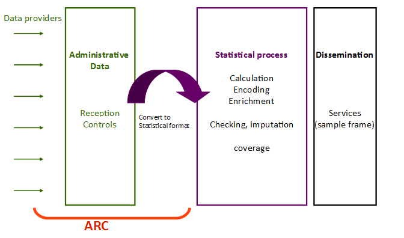
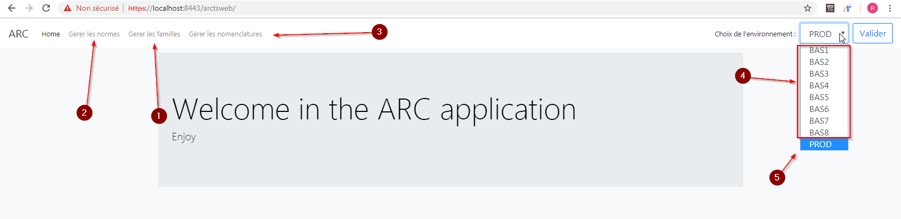
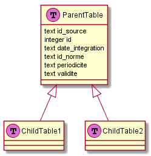
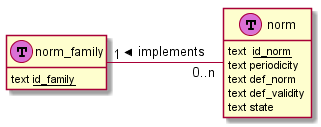
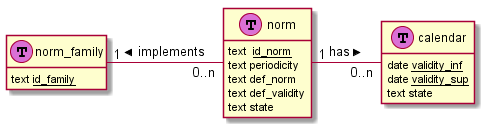
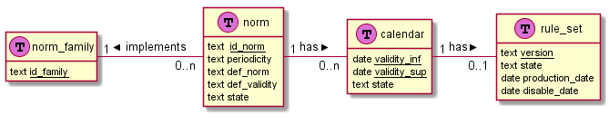
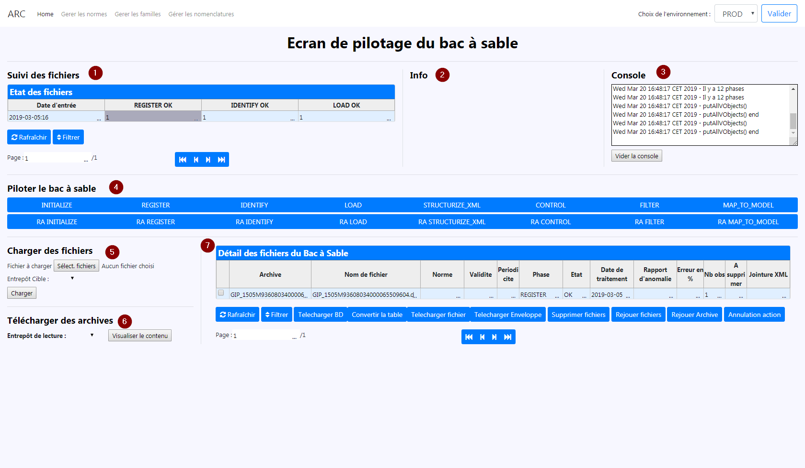

# Arc User guide

- [General présentation of the application](#general-présentation-of-the-application)
- [Module explanation](#module-explanation)
  - [General information](#general-information)
    - [Document logic](#document-logic)
    - [Multithreading](#multithreading)
    - [Inherit tables](#inherit-tables)
  - [Initialization module](#initialization-module)
  - [Register module](#register-module)
  - [Identification module](#identification-module)
  - [Load module](#load-module)
    - [XML loader](#xml-loader)
    - [Key value loader](#key-value-loader)
    - [CSV loader](#csv-loader)
    - [Load output](#load-output)
  - [Structurize XML](#structurize-xml)
    - [Deletion rules](#deletion-rules)
    - [Duplication rules](#duplication-rules)
    - [Independence rules](#independence-rules)
    - [Unity rules](#unity-rules)
    - [Relation rules](#relation-rules)
    - [Structurize XML output](#structurize-xml-output)
  - [Control module](#control-module)
    - [Control output](#control-output)
  - [Filter module](#filter-module)
    - [Filter output](#filter-output)
  - [Map to model module](#map-to-model-module)
- [Norm family management](#norm-family-management)
  - [Norm family presentation](#norm-family-presentation)
  - [Norm family in ARC](#norm-family-in-arc)
- [Norm management](#norm-management)
  - [Norm prensentation](#norm-prensentation)
  - [Calendar](#calendar)
    - [Calendar presentation](#calendar-presentation)
  - [Rule set](#rule-set)
    - [Definition of a rule set](#definition-of-a-rule-set)
  - [Module rules](#module-rules)
    - [Load rules](#load-rules)
    - [Structurize XML rules](#structurize-xml-rules)
    - [Control rules](#control-rules)
    - [Filtering rules](#filtering-rules)
    - [Map to format rules](#map-to-format-rules)
- [External file management](#external-file-management)
- [Sandbox monitoring](#sandbox-monitoring)
- [Production monitoring](#production-monitoring)

## General présentation of the application

The ARC (from the French: Acquisition - Réception - Contrôles) software allows receiving (administrative) data supplied by the providers (several formats are supported, particularly XML), to control the compliance of the received files, and to transform administrative data to elementary statistical data. The software enables the statistician to define and apply controls and mappings, to test them in a sandbox environment (linked to the software), and to put them into production without frequently calling on a developer.

These functionnalities/services aim the statistician’s independence and ability to adapt to the data evolutions, thereby avoiding impacts on the statistical chain.



To achieve this goal, the ARC application need some information

1. Each file is link to a **norm family**. Those families distinguish the main file type and the output model.

2. Each fiile is linked to a **norm** too. The norm is a set of rules describing how the file must be handled.

3. The third information is the file periodicity. 

From the ARC index page you can access to :

1. The norm family management
2. The norm management
3. External resources management
4. The sand box monitoring
5. The production monitoring



## Module explanation

### General information

#### Document logic

One on the feature of Arc is to process the document separately of each other. This is possible because no cross document process are done.

#### Multithreading

For good performances the application use a lot the multithreading. It is possible because of the document logic. Each business module have the same architecture :

1. The module get all the file to process and the relevant information (like the norm, rules etc) ;
2. The module creates a pool of database connection. The pool size is equals to the number of thread run in parallel ;
3. For each file to process, the module create a thread ;
4. The module dispatch its connection pool between the threads and run theirs. Each time a thread end, the module give the connection to another and run it ;
5. The module finalizes the process by updating several database table.

For the rest of this document the module process will mostly refer to the thread module process, because it's the thread that have the business logic, the module just run the threads.

#### Inherit tables

The Arc application use the inheritance between tables of PostgreSQL. This make it possible to keep the document logic in the database.



At the end of each module the data of each file are stored in individual table, but all those tables inherit of a parent table that have some general column, but enable each table to have specific column. Moreover to request the data of spectific file, the system don't have to know the name of the table of the file. Just by requesting the parent table and filter the data with the id_source of the file itget the needed data.

### Initialization module

It's not a business module and will not process the file, but it creates or update all the necessary tables in the sandbox schema in the database. This module is automatically run at the start of all other module.

### Register module

### Identification module

First user defined module, the identification module goal is to find the norm and the validity of a file (see [Norm management](#norm-management)).

To do this, the file is insert in the database by streaming it and the PostreSQL COPY function for quick loading. It's common to have the information to identify the rule in the beginning of the file, so it doesn't load all the file but only some lines. Then all the norm definition rules are parsed in SQL and run. Three cases :

- Only one rule return true. It's the nominal case. The norm of this file is the one of this rule ;

- Two or more rules return true. In this case the application can not decide witch norm to apply, so the file is set in LOAD_KO status ;

- No rule return true. The application load more lines and check the rules again. If at the end of the file, no rules had returned true, the file is set in LOAD_KO status.

If a norm is find the application find is validity with the same process (but now with only the rule of the found norm). Two cases :

- A validity is found. It's the nominal case. The validity of the file is set in the application and is status is set to LOAD_OK ;

- No validity is found. The file is set in LOAD_KO status.

At the end, the *monitoring table* is update with the status of the files, and their norm and validity. No table are created in the database.

### Load module

The goal of the load module is to load the files in the database of ARC. In the previous module the application set a norm for each file. Those norms are used to choose the good way to load the file. Currently there are 3 loaders

- Xml loader ;
- Csv loader ;
- Key value loader.

#### XML loader

The Xml loader is the first loader developed. It can load xml file, with some restriction :

- The file cannot have cyclic objects ;
- The xml attributes are ignored.

This loader don't need any configuration.

To keep the hierarchy of the file is not in tabulate format (it will be tabulated in the structurize xml module). For example if the application load this file :

``` xml
<root>
  <trunk>
    <color> brown </color>
    <state> good </state>
    <branch>
      <leave> leave1 </leave>
    </branch>
    <branch>
    <leave> leave2 </leave>
    </branch>
    <branch>
      <leave> leave3 </leave>
    </branch>	
  </trunk>
  <trunk>
    <color> black </color>
    <state> burned </state>
    <branch>
      <leave> leave5 </leave>
    </branch>
    <branch>
      <leave> leave6 </leave>
    </branch>
  </trunk>
  <root_attribute>
    <age> 45 </age>
    <height> 15m </heighti_ro>
  </root_attribute>
</root>
```

the output table will look like :

| id | i_root | v_root | i_color | v_color | i_state | v_state | i_branch | i_leave | v_leave | i_root_attribute | i_age | v_age | i_height | v_height |
|----|--------|--------|---------|---------|---------|---------|----------|---------|---------|------------------|-------|-------|----------|----------|
| 1 | 1 | 1 | 1 | brown | 1 | good | 1 | 1 | leave1 |  |  |  |  |  |
| 2 | 1 | 1 | 1 | brown | 1 | good | 2 | 2 | leave2 |  |  |  |  |  |
| 3 | 1 | 1 | 1 | brown | 1 | good | 3 | 3 | leave3 |  |  |  |  |  |
| 2 | 1 | 1 | 2 | black | 2 | burned | 4 | 4 | leave4 |  |  |  |  |  |
| 2 | 1 | 1 | 2 | black | 2 | burned | 5 | 5 | leave5 |  |  |  |  |  |
| 6 |  |  |  |  |  |  |  |  |  | 1 | 1 | 45 | 1 | 15m |

Notice the addition of the i_*name attribute* in the table. Those columns will be used by the *structurize xml* module to tabulate the data and keep the hierarchy.

In parallel to that, the application create an SQL join request. This request, like the  i_*name attribute* columns will be used by the *structurize xml* to tabulate the data

<!--
    Create the exemple for the request
-->

#### Key value loader

This loader load key value files like this :

``` js
key1: val1
key2: val2
key3: val3
key1: val4
```

Because the key value file can have an internal hierarchy (like a xml file) but do not provide any way to deduce it, this loader need some configuration :

- The separator between key and value ;
- An xml format for the file.

First the module read the xml format. Then it transforms the key value file in a xml one and load it with the xml loader. To keep good performances, the file is read-transformed in xml-loaded by streaming. This make it possible to process it and never write it on disk.

See [XML loader](#xml-loader)

#### CSV loader

It's the simpler loader of the application. It takes tabulate data in a csv format and insert it in the database with some modification.

In the process, the application need for each attribute a column i_*name attribute* and v_*name attribute*, so it has to create it. The i_*name attribute* are used to keep the hierarchy of the file. A csv file don't have any, so all i_*name attribute* are equals to the line number. The v_*name attribute* contain the value of the column. And the module create an id for each line equals to its line number.

For instance, the file :

```csv
Sexe,First name,Birth year
M,Alphonse,1932
F,Béatrice,1964
F,Charlotte,1988
```

will look like in database :

| id | i_sexe | v_sexe | i_firstName | v_firstName | i_birthYear | v_birthYear |
|----|--------|--------|-------------|-------------|-------------|-------------|
| 1 | 1 | 1932 | 1 | Alphonse | 1 | 1932 |
| 2 | 2 | 1964 | 2 | Béatrice | 2 | 1964 |
| 3 | 3 | 1988 | 3 | Charlotte | 3 | 1988 |

This loader have to be configured with :

- the separator character (by default ; )
- a delimiter (none by default)

This loader uses the PostreSQL COPY command for good performances.

#### Load output

At the end of the load module one line are insert in the monitoring table for each file proceeded. The data of the file in OK state are inserted in a table linked to the LOAD_OK table. This table use the inheritance mecanism (see [inherit tables](#inherit-tables)). The model of the table depends of the model of the file, but here is the pattern :

- Fixed columns
  - id_source
  - id
  - date_integration
  - id_norme
  - periodicity
  - validity
- File depend column
  - i_column of the file
  - v_column of the file

### Structurize XML

The goal of the *Structurize xml* module is to tabulate the output data of the *[load module](#load-module)* and apply user defined structurize rules. Those rules will be parsed in SQL and run by the database. There are 6 types of rules :

- Deletion
- Relation
- Cartesian
- Unicity
- Duplication
- Independence

The *structurize xml* module start by getting all the id source to process and create structurize xml thread (see [Multithreading](#multithreading)).

Each thread creates a working table with the data of its file and edits the SQL join request created by the *[load module](#load-module)*.

To do that, each thread get all the variables use by the full process of Arc for this file. Those rules are stored in

- TRANSFORMATION_REGLE
- CONTROLE_REGLE
- FILTRAGE_REGLE
- MAPPING_REGLE

Then the module update the SQL join request with the rules in this order :

1. Deletion
2. Duplication
3. Independence
4. Unity
5. Relation

#### Deletion rules

The purpose of those rules is, as the name suggest it, to delete some columns. Those rules are special because the application itself can create deletion rules. If a column is never used in the full process of Arc for this file the column is deleteed for optimization. But, if one of the user defined deletion rules delete a needed column for the full process the application stop the module and tag the file as KO.

To apply those rules, the application scan the SQL join request and delete all occurrences of the variables.

#### Duplication rules

Next, the module apply the duplication rules. Their goal is to duplicate block, and give to the new block a new business meaning.

For instance, for a cleaner the same block can be use for his workplace (where he does cleaning) and his employer (the one who pay him). Without duplicate the block it will be impossible to make the join and separate those two things.

Those rules cannot be directly create by the user. They are side effect of relation rules. A duplication rule is created if :

- A relation rule exists
- There is an alias follow by a dot before the rubric name in the column "rubrique nomenclature"
- All the rubrics used by the rule are in the file.

In this case a duplication rules will be created and characterized by the two rubrics it links and the alias. For instance the rule :

| id | type | column | column nomenclature | commentary |
|----|----------|------------------|----------------------------|--------------------------------------------|
| 1 | relation | V_S21_G00_40_046 | siretutil.V_S21_G00_85_001 | relation lieu de travail siret utilisateur |

will create a rule duplication that duplicate the block containing the column V_S21_G00_40_046. It will add the prefix "_siretutil" to the block and all column within.

To implement a duplication rule, the module read the SQL join request, duplicate SQL of the block to duplicate, add the sufix, and add the new block in the final join.

<!-- TODO Explain final join-->

#### Independence rules

Like the duplication rule, the independence rule are not user define but deduce by the module. Theirs purpose is to limit the number of line between unrelated block during the running of the SQL join request.

To detect unrelated block the module begin by create idenpendence rules fore every couple of blocks ans scan the hierarchy of the file and the relation rules. If two blocks are linked with a relation rule, then they are related. Moreover, theirs parents are related two, and the rules previously created are deleted. At the end, all remaining rules are the independence rules to apply.

The user can define *cartesian rules* between two blocks to specify that those blocks are not independent.

#### Unity rules

The *unicity* rules purpose is to keep only one line in a bloc if many have the same id. For instance an enterprise can declare a same workplace multiple  time (one time for each employee). By doing this the module reduce the number of output  line.

#### Relation rules

Finally, the relation rules are applied. They make it possible to link two blocks which don't have any hierarchical bond.

#### Structurize XML output

At the end of the process, the module send to the database the SQL join request. If no error occur an output table linked to STRUCTURISE_XML_OK is created with the sctructurized date and a line in the monitoring table is insert.

To resume, the final output are :

- A line in the monitoring table with the state of the process for the file
- If the file is in OK state, a table linked to the STRUCTURISE_XML_OK table is created with
  - Fixed columns
  - id_source
  - id
  - date_integration
  - id_norme
  - periodicity
  - validity
- File depend column
  - i_column of the file
  - v_column of the file
- If the file is in KO state, a table linked to the STRUCTURISE_XML_KO table is created with
  - Fixed columns
  - id_source
  - id
  - date_integration
  - id_norme
  - periodicity
  - validity
- File depend column
  - i_column of the file
  - v_column of the file

### Control module

The control module goal is to control if a file respect enought rules to be exploitable by the continuation of the process. Those rules can check :

- the format of a column ;
- the cardinality between blocks ;
- a more specific sql condition.

Beside the control check, a control rule can have a sql request named "pre action" to format the data for the check.

First of all, each thread control module copy the data of theirs file from the previous phase output table to a workinh table. Then they get the file's control rules.

The thread get all the "pre action", parsed them in SQL and run them in the working table. Next the module excecute the rules. There is 5 types of rules

- Num : check if the column is numeric and its lenght
- Date : chech if the column have the specify date format
- Alphanum : check the lenght of the column
- Cardinality : check is the relation is 1..n between block
- Condition : check a user definied sql condition

If a line have a failed check, the line is marked in error. After check done the module count how many line are in error, and compute the percentage of error. Three cases are possible :

- the ratio is bigger than a user definied threshold : the file is KO tagged, and all lines go to the KO ouput table;
- the ratio is small than a user definied threshold but not 0 : the file is OK_KO tagged to keep in mind that it has some error. Lines with error go to the KO output table, and the others go to the OK output table ;
- the ratio = 0, file tagged as OK, all lines go to th OK ouput table.

Finally the monitoring table is update with the status of the file, and the working table update the output module table.

#### Control output

To resume, the final output are :

- A line in the monitoring table with the state of the process
  - OK : all lines pass the controls
  - OK_KO : 0 < error_ratio < threshold
  - KO : error_ration > threshold
- If the file is in OK state, a table linked to the CONTROL_OK table is created with
  - Fixed columns
  - id_source
  - id
  - date_integration
  - id_norme
  - periodicity
  - validity
- File depend column
  - i_column of the file
  - v_column of the file
- If the file is in KO state, a table linked to the CONTROL_KO table is created with
  - Fixed columns
  - id_source
  - id
  - date_integration
  - id_norme
  - periodicity
  - validity
- File depend column
  - i_column of the file
  - v_column of the file
- If the file is in OK_KO state, tables linked to CONTROL_OK and CONTROL_KO are created. The line without error go to the CONTROL_OK table, and the other to the CONTROL_KO table.

### Filter module

The filter module goal is to filter some lines following an business condition. Unlike the control module which check technical condition, the filter module is made to keep only some line with a certain business meaning. For instance, you can just keep the people living in a choose city.

First of all, each thread filter module copy the data of theirs file from the previous phase output table to a workinh table. Then they get the file's filter rules.

After that they apply those rules, and for each line tag if the check failed or not. After check done the module count how many line are in error, and compute the percentage of error. Three cases are possible :

After that three cases :

- the ratio is bigger than a user definied threshold : the file is KO tagged and all lines go to the KO ouput table;
- the ratio is small than a user definied threshold but not 0 : the file is OK_KO tagged to keep in mind that it has some deleted line. Lines with error go to the KO output table, and the others go to the OK output table ;
- the ratio = 0, file tagged as OK, all lines are keeped and go to the OK output table.

Finally the monitoring table is update with the status of the file, and the working table update the output module table.

#### Filter output

To resume, the final output are :

- A line in the monitoring table with the state of the process
  - OK : all lines pass the controls
  - OK_KO : 0 < error_ratio < threshold
  - KO : error_ration > threshold
- If the file is in OK state, a table linked to the FILTER_OK table is created with
  - Fixed columns
  - id_source
  - id
  - date_integration
  - id_norme
  - periodicity
  - validity
- File depend column
  - i_column of the file
  - v_column of the file
- If the file is in KO state, a table linked to the FILTER_KO table is created with
  - Fixed columns
  - id_source
  - id
  - date_integration
  - id_norme
  - periodicity
  - validity
- File depend column
  - i_column of the file
  - v_column of the file
- If the file is in OK_KO state, tables linked to FILTER_OK and FILTER_KO are created. The line without error go to the FILTER_KO table, and the other to the FILTER_KO table.

### Map to model module

## Norm family management

### Norm family presentation

The goal of the Arc application is to integrate in a information system data with a stable model from files with a model that can change over time. This stability make simplier the statistical process of the data because you just have to change how you output variables are compute.

One a the best example is the administrative data. It's common that administrative files change over time. Not a big change, but some variables are deleted, renamed, or created. But for your process you maybe need the same tables and variables names every year.

So the norm family work as a metamodel of output. It determine :

- The output tables
- The links between the tables
- The output variables : name and type

For instance, every month you get administrative files about tax named TAXE_FILE and another about salary name SALARY. Those administrative file are not made for statistical process, so you use ARC to make their more "statistic friendly". Those two type of file will be used in different statistical process so you create two norm families, one for the tax files named "TAX" and the other for the salary files named "SALARY". For those two families you will configure the output tables and variables but not how they are computed.

### Norm family in ARC

## Norm management

### Norm prensentation

As said in the [norm family presentation](#norm-family-presentation) the input file model can change over time to follow a new file model. Each model are the **norm** of the file.

The norm itself do not provide a way to process the file, but make it possible to determine the current norm of the file. The "how to process" is reponsability of the rule set(see [rule set](#rule-set)) Norm are linked to a norm family.



Within a norm family exist many norm defined by :

- A name (*id_norm*)
- A periodicity
- An expression to recognize the norm in the file (*def_norm*)
- An expression to find the validity in the file (*def_validity*)

Go back to the example with the tax and salary files. You know that each years the file model change a little. But within a year the model is stable. In other word there is a "norm" for the tax file for the year 2018, 2019, etc. So you create normes like that :

| id_norm | def_norm | def_validity | periodicity | state |
|----------|-------------|--------------|-------------|-|
| TAX_2018 | select 1 from alias_table  where id_source like '%2018%' | SELECT current_date | monthly | active |
| TAX_2019 | select 1 from alias_table  where id_source like '%2019%'  | SELECT current_date | monthly | active |

Once again in the example we didn't have configure how to process the file, just how to identify it's norm (see [Identification module](#identification-module))

### Calendar

#### Calendar presentation

Because there is the need of temporality in the application, a calendar feature has been created. Thanks to is, the application know when some norm are in use or not, and when so rule sets are in use or not (see [rule set](#rule-set)).



A calendar is defined by two dates and a state :

- validity_inf is the minimal vality of a the file to be proceeded ;
- validity_max is the maximal validty of the file to be proceeded ;
- the state determine is the calendat is active or not.

For exemple a file with this norme and validity :

- norme : TAX_2019
- validity : 2019-03-25

And with those calendar for the norm TAX_2019 :

| validity_inf | validity_sup | state |
|----------|-------------|--------------|
| 2019-01-01 | 2019-06-30 | active |
| 2019-07-01 | 2019-12-31 | active |

will be proceeded by the first calendar.

### Rule set

#### Definition of a rule set

The next concept in the arc configuration is the **rule set**. The rule set determine how a file is proceeded. It determine the modules used, they order and they rules. More of that, rule sets make it possible to multiple people to work on the same norm but with different rules. It allow interative and try/error configuration of a new rule set without disturbing the general process.



The rule set is displayed with a table with the different version available, and the status of the rule set.

The version of the rule set is choose freely by the user, it is only used to distinguish a rule set from other.

The status set if the rule set is inactive, in production, or load in a sand box.

### Module rules

> Each rule can have a commentary

#### Load rules

Three parameters :

- File type : curently three available
  - xml
  - csv
  - key value
- Separator : only uses if file type = csv or key value
- Format : the hierarchy of the file in xml. Only use if file type = key value

#### Structurize XML rules

Three parameters :

- Rule type: curently four available
  - relation
  - cartesian
  - deletion
  - unity
- Column : 
  - if type deletion : the column to delete
  - otherwise : one of the two column of the couple
- Column nomenclature : the other column of the couple
<!-- need to change this name-->

#### Control rules

Seven parameters :

- Control type :
  - Cardinality
  - Alphanumeric
  - Numeric
  - Date
  - Condition
- Parent column
  - If controle type = cardinality : the parent column
  - Otherwise : the column to control
- Child column
  - Cardinality only. The other column
- Min :
  - If alphanumeric or numeric : the min lenght of the column
  - If cardinality : the cardinality min
- Max : the max size
  - If alphanumeric or numeric : the max lenght of the column
  - If cardinality : the cardinality max
- SQL condition :
  - If date : the date format to control
  - If condition : the SQL condition
- Pre action SQl : the pre action SQL to run before controling the file.

#### Filtering rules

One parameter :

- The condition

#### Map to format rules

Three parameters :

- output variable : the name of the output variable
- expression : how the variable is compute. Can be very simple, like just using the raw value of a column, or more complicate by using SQL function like CASE WHEN, COALESCE etc.
- Type : the type of the output variable.
<!---  Consolidation : 
Utile uniquement dans Artemis ? 
-->

## External file management

## Sandbox monitoring



1. Monitoring of the module pass by the files
2. Some usefull information in case of error (empty here)
3. A console to see what some log of the application (useful for quick debug)
4. Buttons to do/undo a module
5. Loading files with the GUI
6. Downloading files with the GUI
7. More details about the status of the files

## Production monitoring
