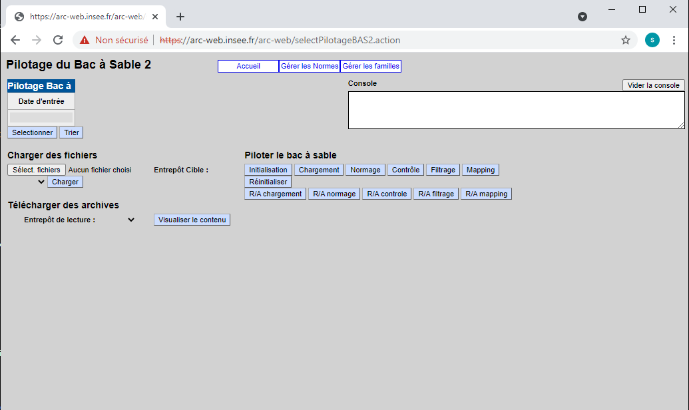
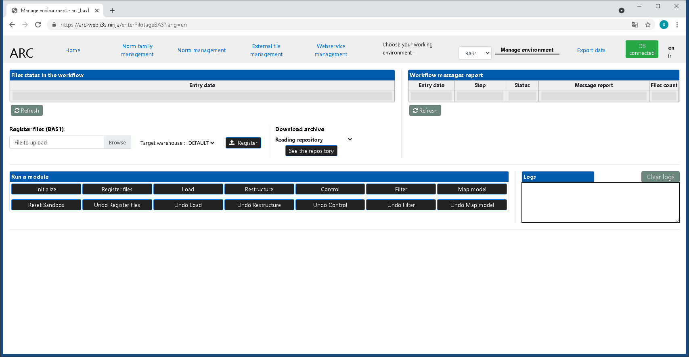

### Implementing new services from existing solutions

 

# ARC

Presenter: Manuel Soulier, INSEE

---

## Acquisition, Reception, Control

- ARC is a software in production at Insee since 2013

- ARC implements for the file acquisition part
	1. a standard pipeline for processing files
		- [GSBPM coverage](arc_gsbpm.png)
	3. a user interface to declare, configure, test and run processing pipelines step by step in "sandboxes"
	4. web services to do the same in machine to machine architectures

---

## ARC Usage

- at Insee, ARC is mainly used by several large information systems, for example the information system on employment and activity income

- ARC is used to load the data on salaries from employers which represents 2,8 millions of files every month and 150 GB
	- Very different from Istat reuse case!

- ARC strong points
	- handle several types of files (XML, plain text...)
	- handle several versions of the files at the same
	- outputs are user-defined models which can evolve at the user's pace, allowing to absorb changes in the input files smoothly

---

## Sharing ARC: roadmap

---

### Open-source the code

---

#### This implied
- translating the codes and comments, removing secrets...
- publishing to Insee's GitHub repository https://github.com/InseeFr/ARC
- automating the continuous integration pipeline
	- to build quality and security indicators
	- to produce the latest service deliverables

---

#### Benefits
* Technical debt greatly reduced by replacing old libraries or frameworks
* ARC's GitHub version is now compliant to Insee's internal production environment standards
* The automation pipelines produce up-to-date Docker images on Docker Hub and up-to-date tags on commit

---

#### To do
* ARC developers and contributers must work on code quality and tests as showed by Sonar

---

### Provide easy way to deploy and try ARC

---

#### This implied
- providing Docker images on Docker Hub
	- web GUI: https://hub.docker.com/r/inseefr/arc
	- web services: https://hub.docker.com/r/inseefr/arc-ws
- deploying ARC on Statistics Norway's cloud infrastructure
	- write the Helm deployment script for Kubernetes

---

#### Benefits
- Even if ARC is a quite standard software, the installation is way more simple when using Helm or DockerApp image
	- the component code and the link between components are automatically pulled or described
- We can now provide a URL to end users who want to try ARC
	- https://arc-web.i3s.ninja/
	- https://arc-ws.i3s.ninja/hello

---

#### To do
- ARC developers must progress on cloud technologies
	- to address application stability
	- to provide security layer and data persistence
	- for further service integration

---

### Integration with other shareable services

---

#### This implied
- developing web services for configuring and executing ARC
- integrate ARC in Istat's IS2 workbench through these web services

---

#### Benefits
- Heavy quality & performance improvements as we had to work hard on the modularity of the ARC engine
	- this convinced ARC's product owner of the improvements provided by the I3S project
- Further reuse of ARC within Insee
	- eg: ARC chosen to check new registrations in the business register
- Integration of ARC in IS2 workbench broaden the functionalities available to statisticians

---

#### To do
- Work on architecture design for service integration with Istat

---

### Improve users understanding and experience

---

#### This implied
- explaining ARC to project owners in a [presentation video](https://www.youtube.com/watch?v=zeiefI85EVo) - English subtitles
- modernizing and internationalizing the user interface
- helping Istat users for the ARC reuse case
	- with a simple [tutorial](arc_tutorial.md)
- implementing inline documentation based on MarkDown (in progress)

---

#### Benefits
- Real use cases such as the reuse of ARC by Istat are very valuable for enriching services
	- the functionality developed for Istat was reused internally shortly afterwards

---

#### To do
- set up a training program for ARC

---

THE END

---

#### ARC legacy GUI

---

#### ARC I3S GUI

---

#### ARC in the Istat IS2 workbench

___

