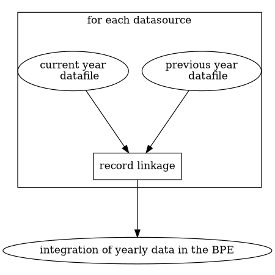

# Implementing Shared Statistical Services - Reuse Report

## Introduction

### Reporting organization
INSEE

### Unit
SNDI Orleans, SDI

### Report version
001

### Report date
12-01-2021

### Contact mail
manuel.soulier@insee.fr

## Service reused
RELAIS application in the IS2 workbench

### Publisher
ISTAT

### Name
IS2

### Version
4fe3b49

### Main functionalities
Deterministic and probabilistic record linkage

### Links (code, documentation...)
#### code
https://github.com/mecdcme/is2

#### readme
https://github.com/mecdcme/is2/blob/master/README.md

## Service reuse

### Context

* The permanent facilities database as known as "BPE" is used to track and keep up to date what community facilities are available on the french territory for a given year.

* BPE is an old application that use deprecated or no more wanted implementations. The process is currently being redesigned.

* The concept of community facilities is broad. Data must be collected each year from several data providers and compared to the data provided the previous year in order to obtain a coherent whole

* The BPE statisticians currently use the old BPE application to achieve this Y-1/Y record linkage

### Business case

* The BPE statistician choose the yearly files to be linked

* The BPE statistician use an interface to set and execute the linkage service

* The BPE statistician can visualize and get the linkage outputs

### Service reuse

#### General description

* The RELAIS application integrated in the IS2 workbench and developped by ISTAT provides a user interface and a record linkage service

* Goal of the REUSE case
    * Assess the suitability of the application with the BPE statisticians needs and expectd results

    * Make RELAIS available to INSEE BPE statisticians for their production work

#### As-Is and To-Do architectures

##### Global current BPE architecture diagram and redesign proposals 
The "Equipement initialization" component would be processed by RELAIS

##### Business and detailed target architecture with IS2/RELAIS

#### Technical details
* Springboot web application, MySQL or postgres database
> [Is there any way to list the lib or components from github ? ]

* volume of input files : Up to 8 millions of rows and 20 columns

#### Organizational impact

* A training for the BPE statisticians to RELAIS application usage and methodology is required as the record linkage configuration is less automatic than the older application and requires a data scientist profile

#### Project management

#### Other aspects (e.g. financial)

#### Results achieved
* The probabilistic record linkage had been sucessfully tried between yearly files (small and big files)

## Lessons learned

### Problems encountered

- the old application process is poorly known so it is hard to validate RELAIS results from that. Maybe strict comparaison is not a good way to validate a reuse case.

### Missing functionalities

- to be able to use outputs as input dataset
    - The deterministic record linkage cannot be use for our reuse case because of that as it remains too simplistic without this capability
    - would be really a simple and great addition for interconnection between applications. Big win ?

- user interface can be a bit confusing
    - step execution should delete the output workset before executing the process. In the current version it adds to the previous output workset and the user has no way to know it
    - The user can fill the roles that are output/input. They sould be hidden, shouldn't they ?
    - The variables affected to input roles can only be deleted one by one

- to be able to export and import rules or push/pull them to/from a repository

### General feedback

- is2 workbench is such a good idea for the stasticians work

- great collaboration with ISTAT to continue if possible

## Conclusions and next steps
- discuss with ISTAT and contribute to cover the missing functionalities ?
- implement a chain of deterministic linkages which looks like the old BPE application process
- results validation for both of deterministic and probabilistic linkages for the BPE use case
