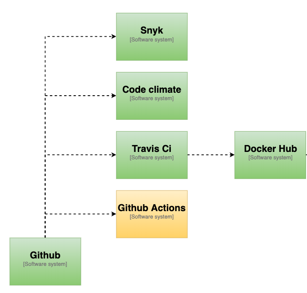

# Blueprint for I3S

## Background
Based on the work done in WP2, and using modern application architecture patterns we want to create a blueprint for a reference runtime environment for modern, sharable services following CSPA standards/principles using containers. It will not give any guidance on how to develop shared services, but will focus on the runtime environment for the services. This work package will describe the basic infrastructure needed, and implement a cloud instance for the needs of the ESSnet. The infrastructure will be documented as code, which will give to its users the opportunity to version it, and fork it. Typical products implementing this pattern would be Ansible Playbook or Terraform. Using the “infrastructure as a code” model will enable NSIs to easily create their own modern infrastructure on their premises. There will also be provided, as part of this WP a simple container-based platform using a cloud infrastructure, which will allow to validate the blueprint and to perform functional tests on the services developed in WP1, as well as validate their packaging and installation.

Retro-fitted, and modularized existing services will also be tested on the platform,either on premise or on the public cloud instance. This work package will also explore security components like IAM (Identity and Access Management), OAuth 2.0 and OPA (Open Policy Agent) for authentication and authorization, or Service Mesh for routing and secure service-to-service communication, for authentication and authorization. The WP will also look into how this type of security components can be added to existing services. Containerization and orchestration technologies, including Kubernetes and Docker, will be the basis of the platform, and all other infrastructure components will be built with it or around it.


### Why we need a container plattform
Traditional infrastrucdture is rigid, costly and not suited for supporting the rapid change in technology. Even with the advent of virtualization, and the ability to run hyper convergent infrastructure on premise, we tend to hit struggle with high complexity of our infrastructure, and high management cost of infrastructure. With high complexity, managing adequate security is also an issue. Containers hide some of this complexity, especially when it comes ot managing softare compatibility between software project, and cloud help us manage underlying infrastructure complexity by using managed infrastructure that can scale depending on the need of the organization.

### Prerequisite
For starting to build services that you want to containerize, you will need a machine that can run Docker as a minimum, or a virtual machine that runs docker. There are also several online options for running containerized services. They greatly vary in price and functionality but can be used as a test for running simple services in the cloud (or on premise).

In general it’s hard to establish and maintain an on-premise, container platform from scratch, depending on your organizations maturity. But there are several good on premise platform-products that will help you with things like security and hardware provisioning, like Apache Mesos, and RedHat OpenShift.


## Containerization
There are several container initiatives, but the one that has been there longest, and have the largest adoption is Docker.  The container format is being standardized as part of the OCI (Open Container Initiative). Containerization is basically a way of creating a small virtual computer, that contains only the virtualized hardware required for the application you want to run, so it works as a way of transporting services without your application having to know anything about the environment around it. This is also its greatest challenge. In WP2 there will be described a lot of architectural guidelines for how you should design your application to make it scalable, and secure, so this document will only reference that work.

## Environment
You can run Docker either on a Windows machine, or a Linux/Mac. Even .Net applications in containers are moving towards running on Linux host-systems, so for minimal pain, you should set up your docker environment on a linux machine, or in a virtual machine running linux. We provide pre-designed virtual environments which have Docker pre-installed which can be used to set up your environment
On premise
For test purposes it should be sufficient to use a standard Docker installation for getting things up and running. For production quality runtime environments for containers and for container orchestration we recommend looking into products like Apache Mesos or RedHat OpenShift.

(*is Docker Swarm also an alternative?*)

## Cloud
* Google Cloud Kubernetes
* Azure Kubernetes Service
* Amazon EC2, Amason EKS.

There is a plethora of other services that will ease the use of these public cloud vendors, like Pivotal's CloudFoundry, which will give you "serverless" functionality that can run on any of the large public cloud vendors. 

## Considerations

...

# Appendix


## Terraform examples 

...

## Container examples

### IS2 example
During the Rome hackathon the Istat application IS2 was containerized. IS2 is a standard Java, Spring Boot web application with a PostgrSQL database. https://github.com/mecdcme/is2

We forked the application and created [Dockerfiles](https://docs.docker.com/engine/reference/builder/) for the database and application.

Database containerization
The `db.Dockerfile` is very simple. The initdb script was already in the existing repository.

```Dockerfile
FROM postgres:11
COPY ./db/is2-postgres.sql /docker-entrypoint-initdb.d/
```

With this dockerfile, we can create and run the dockerimage like this:

```Shell
docker build -t mecdcme/is2-postgres . -f db.Dockerfile
docker run -p 5432:5432 mecdcme/is2-postgres
```

### Application containerization
For the application we take advantage of the [multi-stage build feature in Docker](https://docs.docker.com/develop/develop-images/multistage-build/).  With this Dockerfile we both build the IS2 application with maven AND we create the docker image

```Dockerfile
FROM maven:3.6-jdk-11 AS build
COPY src /usr/src/app/src
COPY pom.xml /usr/src/app
RUN mvn -f /usr/src/app/pom.xml clean package
FROM openjdk:11-jdk-slim
COPY --from=build /usr/src/app/target/is2.jar /usr/app/is2.jar
RUN mkdir -p /usr/app/is2/RScripts
COPY RScripts /usr/app/is2/RScripts
EXPOSE 8080
ENTRYPOINT ["java","-jar","/usr/app/is2.jar"]
```

With this dockerfile, we can create and run the dockerimage like this:

```Shell
docker build -t mecdcme/is2 .
docker run -p 8080:8080 mecdcme/is2 
```

### Docker Compose
The IS2 application is now a multi-container application. To run these two containers and enable them to talk to each other we use [Docker Compose](https://docs.docker.com/compose/). The docker-compose.yml file looks like this:

```YAML
version: '3'
services:
  app:
    image: mecdcme/is2:latest
    ports:
      - 8080:8080
    environment:
      - SPRING_DATASOURCE_URL=jdbc:postgresql://db:5432/postgres?currentSchema=is2
      - SPRING_DATASOURCE_USERNAME=postgres
      - SPRING_DATASOURCE_PASSWORD=postgres
      - SPRING_DATASOURCE_DRIVERCLASSNAME=org.postgresql.Driver
      - SPRING_DATASOURCE_PLATFORM=postgresql
    depends_on:
      - db
    restart: always
  db:
    image: mecdcme/is2-postgres:latest
    environment:
      - POSTGRES_PASSWORD=postgres
  adminer:
    image: adminer
    restart: always
    ports:
      - 8081:8080
```


Start both containers with this single command:

```Shell
docker-compose up
```

### Continuous integration

#### Travis CI
With open-source applications on Github there are many free tools for doing continuous integration. We set up Travis CI for building the application.

.travis.yml
```YAML
language: java
jdk: openjdk11

addons: 
  sonarcloud:
    organisation: "mecdcme"
    token:
      secure: ***

script:
  - mvn clean org.jacoco:jacoco-maven-plugin:prepare-agent install sonar:sonar -Dsonar.projectKey=mecdcme_is2
```

Results at https://travis-ci.org/github/mecdcme/is2

#### Dockerhub
Docker also offer a free service for open source prosjects. We have set up automatic building of images on Dockerhub https://cloud.docker.com/u/mecdcme/

### PxWeb Example

The current version of PxWeb is a legacy ASP.NET 4.6 application. SCB wil port it to ASP.NET Core but until then we wanted to try containerize the current verison. PxWeb was open sourced in August 2019 https://github.com/statisticssweden/PxWeb and forked to https://github.com/I3S-ESSnet/PxWeb 

#### Container
Since PxWeb is a ASP.NET 4.X application the docker image must be build and run on a Windows host.

```Dockerfile
FROM mcr.microsoft.com/dotnet/framework/sdk:4.7.2-windowsservercore-1803 as build
WORKDIR /temp/PxWeb
COPY . .
RUN nuget restore
RUN msbuild /p:Configuration=Release PXWeb/PXWeb.csproj /p:DeployOnBuild=true /p:PublishProfile=filesystem.pubxml

FROM mcr.microsoft.com/dotnet/framework/aspnet:4.7.2-windowsservercore-1803
WORKDIR /inetpub/wwwroot
COPY --from=build /temp/build/. ./
```

Build and run
```
docker build -t pxweb .
docker run -p 80:80 pxweb
```

#### Continuous integration

##### Travis CI

This example builds the Windows container on Travis and publish it on Dockerhub.


> **_NOTE:_**
When using docker images that require Windows hosts.
Travis only support Windows Server, version 1803. 
Github Actions only support Windows Server 2019 and Windows Server 2016 R2
You have to be  aware of this when choosing online services.


The username and password for Dockerhub is encrypted and will break when the repository is forked on GitHub. For more details see https://docs.travis-ci.com/user/environment-variables/#defining-encrypted-variables-in-travisyml

.travis.yml
```YAML
language: shell
os: windows
services: docker

env:
  global:
    - secure: x5Eq9lqHCEXXx5wOuJkHhE/0FUNtEw/RfgJzPHgf3EN23DilrpNkujFwArQawE8GiCkJuxEvssnaOTqNIy1KQ/beSwI/kaOjgiyfIIq+H9nm9k781JnUKIRtHpK9m1dRqv3R7CFDAq3X/n4onliA/BVRBBEVD3GAJ8/Z2+RkFVZvtnyn4F1Atci5tXC/LfgFnwdwyN0PT0dNFmQ0eg6fvhRTF/u9J+yB5Q0Y1BiU6ENDwra2eYfhvDbo0Vl1iQCHR316kOVDG0M0KFot9Ufk9ZW/LAJ0sNgvgnXMgBmnk6d4YH/7PFvqOFIlSfX49gx4VPWnqpIx2G9w8rJImwQNdssTaBf/3vToUay0Mml1Tr8fTLtVgAm0qt1+YK5eZPJjYUoQ/Qffr/rk+voVAkPPtacbmYAQTlM8EZwY3OzZrslsK41lFjU66mit9lnVfcDkW9amG21UWUa9RFiNGKlRc6uUHS1CHlmbeDCUd7QKjsBhvQKFaI8bD92TEAEiASiqRmuy6f468hKuTHEFgsTUUs1z2IMx00SzafAMXRz4jEU47CAdIEleXpyoXTkeKTeGFFYbqKepjo578gcPHfZhYYmqtS2RCPQadV9Cf9UCYCHgyD6bTd5T950bNnfUP73x3BNiHExVr0GD6mW6JE3lXMOLzqSybC093uSYXNGQ9kE=
    - secure: BIgJiXc9JuewbHUYLIMgjh72bYsAI8N3Hu918f5qGDn0QWGHkMG57eMwn1zpu/kV6vm6wqG97MJCLVOvYudmxtOVOkF4wTaVvV3sicQmPWbf9QQct1Cn3mjcCAIwH55HGGstodJhRtbWW9FTZhmjzKW8FS+iS/RWOC3aKRsGHTKnMK4yy2Sb92WbBQ1Sbs3qjYBUshFcSiFIpezQcHYfk8FUILVNhTz39KLzxkpQw4oJqiMksqFLCjWRpU6ZLzQoV2aKT0XeIJsYNYRppTM20byuHfyGKqKHnPmIfyTT2wW3Dt+QTkj3H710CgAvRvJBN7iZKCU5TiMYTWh0tfcTb9M7FU/ZCoNzOvTbAZZ3tOWvGdgc0TuoF0Y9EoOQS13RdRXraMNdCzN4h1RhIXByTTqMxlI+uNwCE9Cc3A4gduXLzWqlir+SG33tjhHzrK15EBs/6d1G9zUO3bfUbsMHf8LubWjxiDNWr7O3cGsybUOCPOy9eWn3TppIXXxgXBAtNUgv46uZQKOhkNnI3wSoLhqo+X3KxVU/gcEO9L74Zh30A3ceQ4ghRGxZTxcvK0ptFTWTsYT8zwzFw5iqRWsIp/qHvk7pVGeWju7cKLjamY8Pxi4lQgUa/PT7YuvYiJRHhffBjp4lwqZG3EOH0cMWi2GqZz//68aqvnLoLUrcs+w=

script:
  - docker build --tag "${DOCKER_USERNAME}/pxweb:latest" .

after_script:
  - docker images

before_deploy:
  - echo "$DOCKER_PASSWORD" | docker login -u "$DOCKER_USERNAME" --password-stdin
  - docker tag "${DOCKER_USERNAME}/pxweb:latest" "${DOCKER_USERNAME}/pxweb:windowsservercore-1803"

deploy:
  provider: script
  script: docker push "${DOCKER_USERNAME}/pxweb:latest" && docker push "${DOCKER_USERNAME}/pxweb:windowsservercore-1803"
  on:
    branch: master
    all_branches: true
```

#### Pipeline


#### Terraform

We want to use [Terraform](https://www.terraform.io/) to provision hardware.
The first example is working great. Se second is not working yet, because the
Windows container require some more parameters.

* [Azure App Service](https://github.com/I3S-ESSnet/PxWeb/tree/master/terraform/azurerm/app-service)
* [Azure Kubernetes Service](https://github.com/I3S-ESSnet/PxWeb/tree/master/terraform/azurerm/kubernetes)
