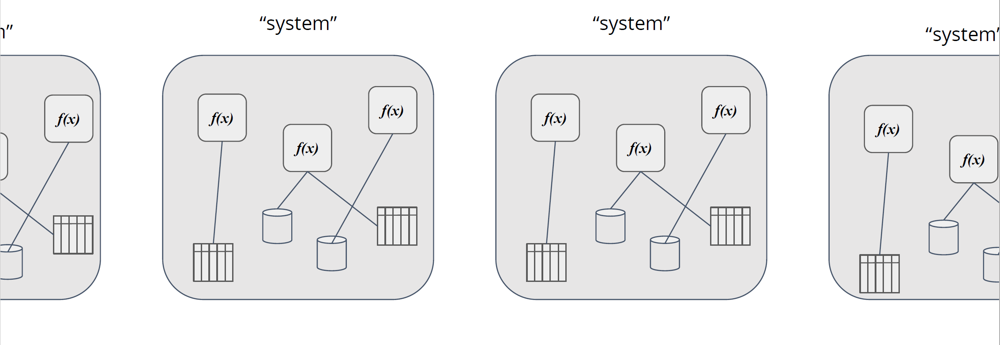
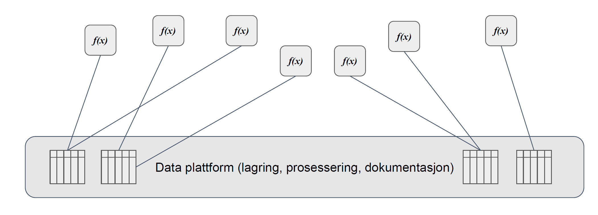

# Blueprint for I3S

Table of Contents
=================

* [Blueprint for I3S](#blueprint-for-i3s)
  * [Background](#background)
    * [Why we need a different infrastructure platform](#why-we-need-a-different-infrastructure-platform)
  * [Providing services](#providing-services)
    * [Scaling capabilities for services](#scaling-capabilities-for-services)
    * [On the discussion of state in services](#on-the-discussion-of-state-in-services)
    * [Centralized or desentralized data](#centralized-or-desentralized-data)
    * [Bottlenecks](#bottlenecks)
      * [Identifying bottlenecks](#identifying-bottlenecks)
    * [Sessions and state](#sessions-and-state)
    * [Containerization](#containerization)
    * [Prerequisite](#prerequisite)
    * [Environment](#environment)
    * [Cloud](#cloud)
  * [Developing services](#developing-services)
    * [Why Open Source matters](#why-open-source-matters)
    * [Open Source makes your software better](#open-source-makes-your-software-better)
    * [Brief history of Open Source](#brief-history-of-open-source)
    * ["Standing on the shoulders of giants"](#standing-on-the-shoulders-of-giants)
    * [Culture](#culture)
    * [Law &amp; Order](#law--order)
    * [Implications](#implications)
  * [Security and logging](#security-and-logging)
    * [Overall security](#overall-security)
    * [Zero Trust](#zero-trust)
    * [Service Mesh](#service-mesh)
    * [User administration and authentication](#user-administration-and-authentication)
    * [Authorization](#authorization)
    * [Logging and Monitoring](#logging-and-monitoring)
    * [Automated Configuration Management](#automated-configuration-management)
    * [Managing secrets](#managing-secrets)
    * [Protecting your source code](#protecting-your-source-code)
    * [Security by obscurity](#security-by-obscurity)
    * [Scanning code](#scanning-code)
    * [Utilizing GitHub and DependaBot](#utilizing-github-and-dependabot)
    * [Scanning containers](#scanning-containers)
    * [Utilizing tools like](#utilizing-tools-like)
    * [Strategies for sealing secrets](#strategies-for-sealing-secrets)
  * [Considerations](#considerations)
* [Appendix](#appendix)
  * [Security checklists](#security-checklists)
    * [Quality level checklist](#quality-level-checklist)
    * [Security checklist](#security-checklist)
    * [Loggin checklist](#loggin-checklist)

## Background
Based on the deliverable related to the definition of integration and architecture guidelines in WP2, and using modern application architecture patterns we want to create a blueprint. The blueprint is describing a reference runtime environment for modern, sharable services following CSPA standards/principles using containers. However, it will not give any guidance on how to develop shared services, as the focus will be on the runtime environment for the services. The deliverable will describe the basic infrastructure needed, and implement a cloud instance for the needs of the ESSnet. The infrastructure will be documented as code, which will give to its users the opportunity to version it, and fork it. Typical products implementing this pattern would be Ansible Playbook or Terraform. One advantage with the “infrastructure as a code” model approach is that it enables NSIs to easily create their own modern infrastructure on their premises. As part of the deliverable we will provide a simple container-based platform using a cloud infrastructure, which will allow us to validate the blueprint and to perform functional tests on the services developed as deliverables in WP1 - Develop new services. This also enables the service developers to validate their packaging and installation.

Retro-fitted, and modularized existing services will also be tested on the platform,either on premise or on the public cloud instance. This work package will also discuss components related security like IAM (Identity and Access Management), OAuth 2.0 and OPA (Open Policy Agent) for authentication and authorization, or Service Mesh for routing and secure service-to-service communication, for authentication and authorization. The blueprint also look into how these types of security components can be added to existing services. Containerization and orchestration technologies, including Kubernetes and Docker, will be the basis of the platform, and all other infrastructure components will be built with it or around it.

### Why we need a different infrastructure platform
Traditional infrastructure is rigid, costly and not suited for supporting the rapid change in technology and agile processes. Even with the advent of virtualization, and the ability to run hyper convergent infrastructure on premise, we tend to hit struggle with high complexity of our infrastructure, and high management cost of infrastructure. With high complexity, managing adequate security is also an issue. Containers hide some of this complexity, especially when it comes to managing software compatibility between software project. Implementing a cloud infrastructure help us manage underlying infrastructure complexity by using managed infrastructure that can scale depending on the need of the organization.

To enable agile business processes, and support the implementation of reusable and shared services 

## Providing services

### Scaling capabilities for services

"... something that can be destroyed or replaced at any time, then it's a member of the herd."

"Pets: Servers or server pairs that are treated as indispensable or unique systems that can never be down. Typically they are manually built, managed, and “hand fed”. Examples include mainframes, solitary servers, HA loadbalancers/firewalls (active/active or active/passive), database systems designed as master/slave (active/passive), and so on."

"Cattle: Arrays of more than two servers, that are built using automated tools, and are designed for failure, where no one, two, or even three servers are irreplaceable. Typically, during failure events no human intervention is required as the array exhibits attributes of “routing around failures” by restarting failed servers or replicating data through strategies like triple replication or erasure coding. Examples include web server arrays, multi-master datastores such as Cassandra clusters, multiple racks of gear put together in clusters, and just about anything that is load-balanced and multi-master."

"... systems are designed for failure ..." also applies for Pets, however they are "... sysems that require "special handling" ..."

Reference: http://cloudscaling.com/blog/cloud-computing/the-history-of-pets-vs-cattle/

### On the discussion of state in services

..

### Centralized or desentralized data

..
[Clarification: We are not talking about blockchain?]
??
* reduce (no) single point of failure
* liveliness

### Bottlenecks
..

Consider if bottlenecks is resolvable through refactoring before considering
* Horizontally scaling of service
* Increase resource allocation for component

#### Identifying bottlenecks
Key performance indicators (tecnical): request/sec, latency, request duration, cpu-time, memory usage, heap usage, garbage collection etc. One should also consider external metrics like business metrics.

### Sessions and state

..

### Containerization
There are several container initiatives, but the one that has been there longest, and have the largest adoption is Docker.  The container format is being standardized as part of the OCI (Open Container Initiative). Containerization is basically a way of creating a small virtual computer, that contains only the virtualized hardware required for the application you want to run, so it works as a way of transporting services without your application having to know anything about the environment around it. This is also its greatest challenge. In WP2 there will be described a lot of architectural guidelines for how you should design your application to make it scalable, and secure, so this document will only reference that work. A container is basically a virtual machine, but with as little or as much as you need to be able to run your application.

### Prerequisite
For starting to build services that you want to containerize, you will need a machine that can run Docker as a minimum, or a virtual machine that runs docker. There are also several online options for running containerized services. They greatly vary in price and functionality but can be used as a test for running simple services in the cloud (or on premise).

In general it’s hard to establish and maintain an on-premise, container platform from scratch, depending on your organizations maturity. But there are several good on premise platform-products that will help you with things like security and hardware provisioning, like Apache Mesos, and RedHat OpenShift.

### Environment
You can run Docker either on a Windows machine, or a Linux/Mac. Even .Net applications in containers are moving towards running on Linux host-systems (from .Net Core), so for minimal pain, you should set up your docker environment on a Linux machine, or in a virtual machine running Linux. 

We provide pre-designed virtual environments which have Docker pre-installed which can be used to set up your environment
On premise

For test purposes it should be sufficient to use a standard Docker installation for getting things up and running. For production quality runtime environments for containers and for container orchestration we recommend looking into products like Apache Mesos or RedHat OpenShift.

### Cloud
* Google Cloud Kubernetes
* Azure Kubernetes Service
* Amazon EC2, Amason EKS.

There is a plethora of other services that will ease the use of these public cloud vendors, like Pivotal's CloudFoundry, which will give you "serverless" functionality that can run on any of the large public cloud vendors. 

## Developing services
### Why Open Source matters
The use of open source provides greater freedom to choose both products and technology that are right for your organization. It makes it easier to choose as little or as much as one needs at any given time. It also gives your organization the freedom to choose vendors and expertise in the market. 

Sharing code nationally and internationally improve quality and encourage reuse of code across organizations and borders.  

* Technology not enough for rapid change
* Culture, and specifically sharing culture contributes speed
* Open source is what is now contributing Innovation
* Open Source is more than reusing code GitHub
* Focus on internal and external sharing
* Transparency rather than closed
* Transparency promotes quality

### Open Source makes your software better

..

* TCO - Total Cost of Ownership
* change cost
* reusability
* competence and recruitment (the future)
* showing your work (transparancies, governmental services), including publuc trust

### Brief history of Open Source

..

### "Standing on the shoulders of giants"

..

### Culture

..

### Law & Order 

..

### Implications
* The right competence to choose the right products for the right purposes, in addition to basic knowledge of open source licensing
* In order to share code internationally, English should (must?) be used as a development language
* Make sure that code is decomposed so that specific business logic is separated from the code that may be of general interest
* When suspending all or part of the development, must your organization enure that you have the copyright to the code being developed and/or ensure that the source code can be shared under an open license
* There may be reasons why one chooses products/solutions that are not open source, but then quality, scope and degree to which the product provides for strong links to the architecture must be assessed and documented

## Security and logging
### Overall security
The description provides a brief documentation with an overview of relevant concepts to support a security modell for establishing services in a cloud environment. The documentation is based on the description of the security model in Statistics Norway (SSB Developer Guide) and documentation of deliverables in WP1, WP2 and WP3 in I3S. 

### Zero Trust
Zero Trust, Zero Trust Network, or Zero Trust Architecture refer to security concepts and threat model that no longer assumes that actors, systems or services operating from within the security perimeter should be automatically trusted, and instead must verify anything and everything trying to connect to its systems before granting access.

Service mesh is often considered as an important infrastructure component for facilitating Zero Trust in a micro service architecture.

References:
- [What is a Zero Trust Architecture?](https://www.infradata.com/resources/what-is-a-zero-trust-architecture/)
- [BeyondProd](https://cloud.google.com/security/beyondprod)
- [BeyondCorp](https://cloud.google.com/beyondcorp)
- [BeyondTrust](https://www.beyondtrust.com/blog/entry/why-zero-trust-is-an-unrealistic-security-model)

### Service Mesh
In software architecture, a service mesh is a dedicated infrastructure layer for facilitating service-to-service communications between micro services, often using a sidecar proxy.

Having such a dedicated communication layer can provide a number of benefits, such as providing observability into communications, providing secure connections, or automating retries and backoff for failed requests.

References:
- [Service mesh](https://en.wikipedia.org/wiki/Service_mesh)
- [What is Istio?](https://istio.io/latest/docs/concepts/what-is-istio/)

### User administration and authentication
Authentication is the process of verifying a users identity.

*Azure AD is used as the identity provider for SSB users. Users and groups are managed in an on prem AD and synchronized to Azure AD. Keycloak is used for providing OAuth 2 and OIDC support to applications running in Google Kubernetes Engine (GKE). Read more about authentication in BIP in the Authentication services documentation.*

### Authorization
Role-based access control (RBAC) is a method of restricting access to data and operations a user can perform based on the users role in the Organization.

Access control in applications running in BIP should be implemented using a role based access control system. But it is possible that Attribute based access control (ABAC) is used to some extent, especially when it comes to data ownership.

### Logging and Monitoring
Logging is important in any security model for auditing and forensics.

Log scraping should be done for alle Applications. It is especially important that access related information is logged by applications to assist with auditing.

References:
- [OWASP Logging Guide](https://owasp.org/www-pdf-archive/OWASP_Logging_Guide.pdf)
- [Logging Cheat Sheet](https://cheatsheetseries.owasp.org/cheatsheets/Logging_Cheat_Sheet.html)

### Automated Configuration Management
The role of automated configuration management is to maintain systems in a desired state in order to reduce cost, complexity and errors. This is especially important in a Zero Trust architecture where configuration transparency, traceability and consistency in a system is essential for security.

Terraform, Ansible and declarative manifests for describing system and application state and GIT for change management and traceability is often used.

### Managing secrets
Secrets like passwords, certificates and keys are probably the hardest assets to manage in any system, but also the most important asset. Leaked keys can lead to unauthorized access to sensitive data and have severe consequences for the organizations trust, reputation and reliability.

Examples of tools is Secret Manager, Berglas and Sealed secrets. 

### Protecting your source code

..

### Security by obscurity

..

### Scanning code

..

### Utilizing GitHub and DependaBot 

..

### Scanning containers

..

### Utilizing tools like 

..

### Strategies for sealing secrets

..

## Considerations

...

# Appendix

## Security checklists
### Quality level checklist
* Consider authentication requirements for exposed endpoints
* Consider encryption of data "at rest" based on classification levels, and at least encryption with the key provided by the service provider
* Ensure that configuration and secrets outside the container is safe and encrypted
* Consider using a standard for assessing the severity of computer system security vulnerabilities (for instance CVSS)

### Security checklist
* Ensure that events and transactions that are logged are possible to trace
* Ensure that any secrets and configurations are safely stored
* Ensure that the container for the service does not run as root
* Ensure that services that should be exposed are available with HTTPS on a public domain
* Ensure that any service accounts has the least necessary priviliges
* Consider high availability and automatic scaling configuration for the service
* Ensure that a vulnerability scanning of the container for the service is performed
* Ensure that any known vulnerabilities of the service are documented
* Ensure that the logs are stored safely

### Loggin checklist
* Never log sensitive information
* Define for how long the logs should be valid and stored
* Ensure that the logs are deleted when they are not longer valid
* Ensure that the logs are structured and have a defined format
* Ensure that the logs are machine readable
* Ensure that the logs are available for any developers that needs them
* Ensure that the logs are available for privileged users (how?)
* Ensure that the logs are backed up
* Ensure that you log at the appropriate level and context
