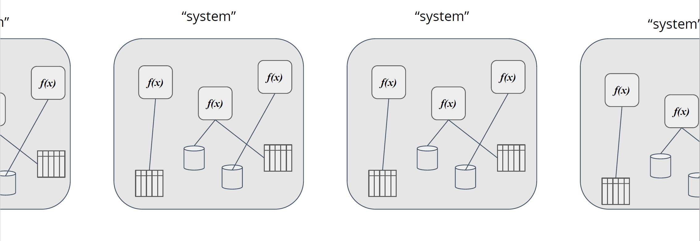

# Scaling capabilities for services

"... something that can be destroyed or replaced at any time, then it's a member of the herd."

"Pets: Servers or server pairs that are treated as indispensable or unique systems that can never be down. Typically they are manually built, managed, and “hand fed”. Examples include mainframes, solitary servers, HA loadbalancers/firewalls (active/active or active/passive), database systems designed as master/slave (active/passive), and so on."

"Cattle: Arrays of more than two servers, that are built using automated tools, and are designed for failure, where no one, two, or even three servers are irreplaceable. Typically, during failure events no human intervention is required as the array exhibits attributes of “routing around failures” by restarting failed servers or replicating data through strategies like triple replication or erasure coding. Examples include web server arrays, multi-master datastores such as Cassandra clusters, multiple racks of gear put together in clusters, and just about anything that is load-balanced and multi-master."

"... systems are designed for failure ..." also applies for Pets, however they are "... sysems that require "special handling" ..."

Reference: http://cloudscaling.com/blog/cloud-computing/the-history-of-pets-vs-cattle/

## On the discussion of state in services

..

## Centralized or desentralized data

..
[Clarification: We are not talking about blockchain?]
??
* reduce (no) single point of failure
* liveliness

## Bottlenecks
..

Consider if bottlenecks is resolvable through refactoring before considering
* Horizontally scaling of service
* Increase resource allocation for component

### Identifying bottlenecks
Key performance indicators (tecnical): request/sec, latency, request duration, cpu-time, memory usage, heap usage, garbage collection etc. One should also consider external metrics like business metrics.

## Sessions and state

..
