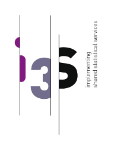
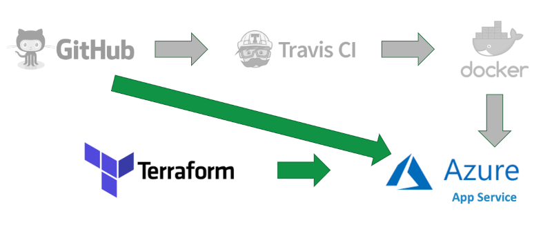

# Cloud Platform Implementing the Blueprint

  * [From project description](#from-project-description)
  * [1\. Containers](#1-containers)
    * [IS2 example](#is2-example)
    * [Application containerization](#application-containerization)
    * [Docker Compose](#docker-compose)
    * [Continuous integration](#continuous-integration)
    * [PxWeb Example](#pxweb-example)
  * [2\. Platform Deployathons](#2-platform-deployathons)
    * [Participants](#participants)
    * [Building the platform](#building-the-platform)
    * [Deploying the services](#deploying-the-services)
    * [Packaging](#packaging)
    * [Accessing the cluster](#accessing-the-cluster)
  * [3\. PxWeb on Azure](#3-pxweb-on-azure)
    * [Azure Kubernetes Service (AKS)](#azure-kubernetes-service-aks)
    * [Azure App Service with Docker](#azure-app-service-with-docker)
    * [Azure App Service with Github](#azure-app-service-with-github)
  * [4\. Try the GCP platform yourself](#4-try-the-gcp-platform-yourself)
    * [Create Google cloud project and service\-account](#create-google-cloud-project-and-service-account)
    * [Create Kubernetes cluster](#create-kubernetes-cluster)
    * [Test Kubernetes cluster](#test-kubernetes-cluster)
    * [Install reverse proxy nginx\-ingress with Helm](#install-reverse-proxy-nginx-ingress-with-helm)
    * [Install IS2 with Helm on Kubernetes](#install-is2-with-helm-on-kubernetes)

## From project description
The focus of WP3 was to establish a sandbox platform for implementation of shared statistical services as a delivery in WP1 in order to perform functional tests and validate the packaging and installation of shared services. Methods and technologies for containerizing services has been studied and implemented. This document describes the necessary technical capabilities for a basic infrastructure and implementation of cloud instances and serves as the foundation for WP1 deliveries. 

Although this document serves as a guideline for implementing the infrastructure, it is also implemented using the "infrastructure as code" model. This enable developers to version and fork the infrastructure and enable NSIs to create their own modern infrastructure in their own ecosystem. 

This document and "infrastructure as code" describes how the I3S-project has containerized and implemented the applications as shared statistical services on two service providers of cloud platforms. The following services was part of delivery: 
- [D3.2.1 ARC](https://ec.europa.eu/eurostat/cros/content/i3s-d321-package-container-service-1_en) Google Cloud Platform (GCP)
- [D3.2.2 PXWeb](https://ec.europa.eu/eurostat/cros/content/i3s-d322-package-container-service-2_en) Microsoft Azure
- [D3.2.3 Relais (IS2)](https://ec.europa.eu/eurostat/cros/content/i3s-d323-package-container-service-3_en) Google Cloud Platform (GCP)

The platform will use a standard solution like, for example, Amazon Web Services, Microsoft Azure or Google Cloud Platform. Technologies used for the building and implementation of the shared services is showed in the figure below. 


:warning: (Structure and eventually reference to delivery slip for "infrastructure as code")

## 1. Containers

### IS2 example
During the Rome hackathon the Istat application IS2 was containerized. IS2 is a standard Java, Spring Boot web application with a PostgrSQL database. https://github.com/mecdcme/is2

We forked the application and created [Dockerfiles](https://web.archive.org/web/20210423075000/https://docs.docker.com/engine/reference/builder/) for the database and application.

Database containerization
The `db.Dockerfile` is very simple. The `initdb` script was already in the existing repository.

```Dockerfile
FROM postgres:11
COPY ./db/is2-postgres.sql /docker-entrypoint-initdb.d/
```

With this dockerfile, we can create and run the dockerimage like this:

```Shell
docker build -t mecdcme/is2-postgres . -f db.Dockerfile
docker run -p 5432:5432 mecdcme/is2-postgres
```

### Application containerization
For the application we take advantage of the [multi-stage build feature in Docker](https://web.archive.org/web/20210423075000/https://docs.docker.com/develop/develop-images/multistage-build/).  With this Dockerfile we both build the IS2 application with maven AND we create the docker image

```Dockerfile
FROM maven:3.6-jdk-11 AS build
COPY src /usr/src/app/src
COPY pom.xml /usr/src/app
RUN mvn -f /usr/src/app/pom.xml clean package
FROM openjdk:11-jdk-slim
COPY --from=build /usr/src/app/target/is2.jar /usr/app/is2.jar
RUN mkdir -p /usr/app/is2/RScripts
COPY RScripts /usr/app/is2/RScripts
EXPOSE 8080
ENTRYPOINT ["java","-jar","/usr/app/is2.jar"]
```

With this dockerfile, we can create and run the dockerimage like this:

```Shell
docker build -t mecdcme/is2 .
docker run -p 8080:8080 mecdcme/is2 
```

### Docker Compose
The IS2 application is now a multi-container application. To run these two containers and enable them to talk to each other we use [Docker Compose](https://web.archive.org/web/20210423075000/https://docs.docker.com/compose/). The docker-compose.yml file looks like this:

```YAML
version: '3'
services:
  app:
    image: mecdcme/is2:latest
    ports:
      - 8080:8080
    environment:
      - SPRING_DATASOURCE_URL=jdbc:postgresql://db:5432/postgres?currentSchema=is2
      - SPRING_DATASOURCE_USERNAME=postgres
      - SPRING_DATASOURCE_PASSWORD=postgres
      - SPRING_DATASOURCE_DRIVERCLASSNAME=org.postgresql.Driver
      - SPRING_DATASOURCE_PLATFORM=postgresql
    depends_on:
      - db
    restart: always
  db:
    image: mecdcme/is2-postgres:latest
    environment:
      - POSTGRES_PASSWORD=postgres
  adminer:
    image: adminer
    restart: always
    ports:
      - 8081:8080
```


Start both containers with this single command:

```Shell
docker-compose up
```

### Continuous integration

#### Travis CI
With open-source applications on Github there are many free tools for doing continuous integration. We set up Travis CI for building the application.

.travis.yml
```YAML
language: java
jdk: openjdk11

addons: 
  sonarcloud:
    organisation: "mecdcme"
    token:
      secure: ***

script:
  - mvn clean org.jacoco:jacoco-maven-plugin:prepare-agent install sonar:sonar -Dsonar.projectKey=mecdcme_is2
```

Results at https://travis-ci.org/github/mecdcme/is2

#### Dockerhub
Docker also offer a free service for open source projects. We have set up automatic building of images on [Dockerhub/mecdme](https://cloud.docker.com/u/mecdcme/) 

### PxWeb Example

The current version of PxWeb is a legacy ASP.NET 4.6 application. SCB wil port it to ASP.NET Core but until then we wanted to try containerize the current version. PxWeb was open sourced in August 2019 https://github.com/statisticssweden/PxWeb and forked to https://github.com/I3S-ESSnet/PxWeb 

#### Container
Since PxWeb is a ASP.NET 4.X application the docker image must be build and run on a Windows host.

```Dockerfile
FROM mcr.microsoft.com/dotnet/framework/sdk:4.7.2-windowsservercore-1803 as build
WORKDIR /temp/PxWeb
COPY . .
RUN nuget restore
RUN msbuild /p:Configuration=Release PXWeb/PXWeb.csproj /p:DeployOnBuild=true /p:PublishProfile=filesystem.pubxml

FROM mcr.microsoft.com/dotnet/framework/aspnet:4.7.2-windowsservercore-1803
WORKDIR /inetpub/wwwroot
COPY --from=build /temp/build/. ./
```

Build and run
```
docker build -t pxweb .
docker run -p 80:80 pxweb
```

#### Continuous integration

##### Travis CI

This example builds the Windows container on Travis and publish it on Dockerhub.


> **_NOTE:_**
When using docker images that require Windows hosts.
Travis only support Windows Server, version 1803. 
Github Actions only support Windows Server 2019 and Windows Server 2016 R2
You have to be  aware of this when choosing online services.


The username and password for Dockerhub is encrypted and will break when the repository is forked on GitHub. For more details see [defining-encrypted-variables-in-travisyml](https://web.archive.org/web/20210423075000/https://docs.travis-ci.com/user/environment-variables/#defining-encrypted-variables-in-travisyml)

.travis.yml
```YAML
language: shell
os: windows
services: docker

env:
  global:
    - secure: x5Eq9lqHCEXXx5wOuJkHhE/0FUNtEw/RfgJzPHgf3EN23DilrpNkujFwArQawE8GiCkJuxEvssnaOTqNIy1KQ/beSwI/kaOjgiyfIIq+H9nm9k781JnUKIRtHpK9m1dRqv3R7CFDAq3X/n4onliA/BVRBBEVD3GAJ8/Z2+RkFVZvtnyn4F1Atci5tXC/LfgFnwdwyN0PT0dNFmQ0eg6fvhRTF/u9J+yB5Q0Y1BiU6ENDwra2eYfhvDbo0Vl1iQCHR316kOVDG0M0KFot9Ufk9ZW/LAJ0sNgvgnXMgBmnk6d4YH/7PFvqOFIlSfX49gx4VPWnqpIx2G9w8rJImwQNdssTaBf/3vToUay0Mml1Tr8fTLtVgAm0qt1+YK5eZPJjYUoQ/Qffr/rk+voVAkPPtacbmYAQTlM8EZwY3OzZrslsK41lFjU66mit9lnVfcDkW9amG21UWUa9RFiNGKlRc6uUHS1CHlmbeDCUd7QKjsBhvQKFaI8bD92TEAEiASiqRmuy6f468hKuTHEFgsTUUs1z2IMx00SzafAMXRz4jEU47CAdIEleXpyoXTkeKTeGFFYbqKepjo578gcPHfZhYYmqtS2RCPQadV9Cf9UCYCHgyD6bTd5T950bNnfUP73x3BNiHExVr0GD6mW6JE3lXMOLzqSybC093uSYXNGQ9kE=
    - secure: BIgJiXc9JuewbHUYLIMgjh72bYsAI8N3Hu918f5qGDn0QWGHkMG57eMwn1zpu/kV6vm6wqG97MJCLVOvYudmxtOVOkF4wTaVvV3sicQmPWbf9QQct1Cn3mjcCAIwH55HGGstodJhRtbWW9FTZhmjzKW8FS+iS/RWOC3aKRsGHTKnMK4yy2Sb92WbBQ1Sbs3qjYBUshFcSiFIpezQcHYfk8FUILVNhTz39KLzxkpQw4oJqiMksqFLCjWRpU6ZLzQoV2aKT0XeIJsYNYRppTM20byuHfyGKqKHnPmIfyTT2wW3Dt+QTkj3H710CgAvRvJBN7iZKCU5TiMYTWh0tfcTb9M7FU/ZCoNzOvTbAZZ3tOWvGdgc0TuoF0Y9EoOQS13RdRXraMNdCzN4h1RhIXByTTqMxlI+uNwCE9Cc3A4gduXLzWqlir+SG33tjhHzrK15EBs/6d1G9zUO3bfUbsMHf8LubWjxiDNWr7O3cGsybUOCPOy9eWn3TppIXXxgXBAtNUgv46uZQKOhkNnI3wSoLhqo+X3KxVU/gcEO9L74Zh30A3ceQ4ghRGxZTxcvK0ptFTWTsYT8zwzFw5iqRWsIp/qHvk7pVGeWju7cKLjamY8Pxi4lQgUa/PT7YuvYiJRHhffBjp4lwqZG3EOH0cMWi2GqZz//68aqvnLoLUrcs+w=

script:
  - docker build --tag "${DOCKER_USERNAME}/pxweb:latest" .

after_script:
  - docker images

before_deploy:
  - echo "$DOCKER_PASSWORD" | docker login -u "$DOCKER_USERNAME" --password-stdin
  - docker tag "${DOCKER_USERNAME}/pxweb:latest" "${DOCKER_USERNAME}/pxweb:windowsservercore-1803"

deploy:
  provider: script
  script: docker push "${DOCKER_USERNAME}/pxweb:latest" && docker push "${DOCKER_USERNAME}/pxweb:windowsservercore-1803"
  on:
    branch: master
    all_branches: true
```

#### Pipeline


---

## 2. Platform Deployathons
We arranged a series of events called "Deployathons" to make a real platform and deploy [IS2](https://github.com/mecdcme/is2) and [ARC](https://github.com/InseeFr/ARC) using state of the art solutions.

:information_source: Here are the [original notes from deployathons](https://web.archive.org/web/20210423075000/https://hackmd.io/1aWd6CawSyKSI0fiMCkD2A) 

### Participants

* France: Oliver Levitt, Donatien Enneman, Romain Tailhurat, Manu Soulier
* Norway: Rune Johansen, Trygve Falch
* Italy: Mauro Bruno, Francesco Amato

### Building the platform
The first part of the job is to set up a container platform. We make the easy choice: [Kubernetes](https://web.archive.org/web/20210423075000/https://kubernetes.io/). Moreover, it will be Kubernetes (a.k.a k8s or Kube) on [GCP](https://web.archive.org/web/20210423075000/https://cloud.google.com/) using Google's managed Kubernetes service : [GKE](https://web.archive.org/web/20210423075000/https://cloud.google.com/kubernetes-engine/).  Managed Kubernetes means that the cloud provider handles most of the configuration. Kubernetes is also installable on-premise with a little more work not covered here (see [Kubespray](https://web.archive.org/web/20210423075000/https://github.com/kubernetes-sigs/kubespray) or [Openshift](https://web.archive.org/web/20210423075000/https://www.openshift.com/) for on-premise alternatives).

#### Terraform
[Terraform](https://web.archive.org/web/20210423075000/https://www.terraform.io/) is one of the leading [infrastructure-as-code](https://web.archive.org/web/20210423075000/https://en.wikipedia.org/wiki/Infrastructure_as_code) solution nowadays.

The GKE managed service takes care of the master nodes. We only have to create and provision worker nodes.
Because the worker nodes are the ones that are use for computation they must be rightfully sized. 

Here, we choose a pool of three worker nodes. 

:warning: Those are preemptible nodes, i.e. that are short-lived and could be recycled at any times. See [running preemptible VMs](https://web.archive.org/web/20210423075000/https://cloud.google.com/kubernetes-engine/docs/how-to/preemptible-vms) for more details. This is less of an issue than you may anticipate as resilience is done at scale on a Kubernetes cluster. Nonetheless, production-grade clusters should probably avoid running only preemptible nodes.

```YAML
resource "google_container_node_pool" "primary_preemptible_nodes" {
  name       = "my-node-pool"
  location   = "europe-west1-b"
  cluster    = google_container_cluster.primary.name
  node_count = 3
  management {
     auto_repair = true
     auto_upgrade = true
  }

  node_config {
    preemptible  = true
    machine_type = "e2-small"
    
    [...]
  }
}
```  

#### Google Kubernetes Engine (GKE) Pricing
Pricing can be confusing so we will try to explain it. 

Google offers [Free Tier](https://web.archive.org/web/20210423075000/https://cloud.google.com/free) but Kubernetes Node pools of `f1-micro` machines are not supported due to insufficient memory. What is free, is the cluster management fee for your first cluster.

> **One Autopilot or Zonal cluster per month**
>
> One-click container orchestration via Kubernetes clusters, managed by Google.
>
> No cluster management fee for one Autopilot or Zonal cluster per billing account
> For clusters created in Autopilot mode, pods are billed per second for vCPU, memory, and > disk resource requests
> For clusters created in Standard mode, each user node is charged at standard Compute Engine pricing

FYI in february 2021 after the last deployathon, Google launched [GKE Autopilot](https://web.archive.org/web/20210423075000/https://cloud.google.com/blog/products/containers-kubernetes/introducing-gke-autopilot). Examples in this document uses GKE Standard 

#### Service account
Terraform needs a GCP service account to create and modify the infrastructure.  
The exact required permissions were not defined clearly so we opted for the easy (but less secure) way : creating a service account with `Project owner` role.  

#### Running the scripts
```sh
terraform init  
terraform apply
```
#### Notes
- Each time terraform operates, it creates or updates a file called `terraform.tfstate`. This file should be stored and kept up to date. If you ever lose it, you won't be able to make any changes to your infrastructure anymore using terraform (sometimes referred to as `orphaned infrastructure`). Some hackys workarounds exist to manually recover a lost tfstate file : [recovering-terraform-state](https://web.archive.org/web/20210423075000/https://medium.com/@abtreece/recovering-terraform-state-69c9966db71e)
- Basic way to store the `tfstate` file would be a private git repository (tfstate usually contains secrets). For a large project, it is useful to store the [state](https://web.archive.org/web/20210423075000/https://www.terraform.io/docs/state/index.html) of the infra using a [remotely available tfstate](https://web.archive.org/web/20210423075000/https://www.terraform.io/docs/state/remote.html) file.

#### Authenticating to the Kubernetes API server
Now that the cluster is up, we can interact with the API server.  
This requires authentication.  
GKE only supports google authentication mechanism (`gcloud container clusters get-credentials my-gke-cluster --region europe-west1-b` creates the kubectl config file with credentials).  
Once authenticated to the cluster, we chose to create a service account (using `kubectl`) and gave it `cluster-admin` permissions to that anyone with the corresponding token could interact with the cluster. This is a basic usage of the `RBAC` authorization system built-in Kubernetes (see [Kubernetes RBAC](https://web.archive.org/web/20210423075000/https://kubernetes.io/docs/reference/access-authn-authz/rbac/)).

At Insee, authentication to the cluster is done using `openidconnect`. As this is not supported on `GKE` clusters (whereas it's supported out of the box on on-premise clusters), a workaround is to install a proxy apiserver. See [Jetstack oidc proxy](https://github.com/jetstack/kube-oidc-proxy) and https://github.com/InseeFrLab/cloud-scripts/tree/master/gke/postinstall/oidc  
This is a step forward consistent authentication across multiple clusters regardless of their status (cloud-managed or on-premise).

### Deploying the services
Using the created GKE cluster, we deploy [the IS2 application](https://github.com/mecdcme/is2).

We use the two existing Docker :whale: images created in the first chapter of this document 
- is2: https://hub.docker.com/repository/docker/mecdcme/is2
- is2-postgres: https://hub.docker.com/repository/docker/mecdcme/is2-postgres

#### Best practices
A by-product of deploying an existing app to a container orchestrator is that some enhancements appear to make it more cloud-native. Here are the best practices suggested for IS2:

- the web app should be able to run solo (without a database). [h2](https://web.archive.org/web/20210423075000/https://www.h2database.com/html/main.html) is a good way to achieve this and is supported by default by spring-boot. 
- The database should rely on the default postgres image instead of maintaining a specific is2 database image and execute one or several scripts at runtime using the underlying orchestrator capabilities (docker volumes, docker compose, kubernetes init containers...). Database schema could also be provided by the application itself. Various libraries and frameworks such as [Flyway](https://web.archive.org/web/20210423075000/https://flywaydb.org/) help achieve this.  
- The app should aim at being as stateless as possible so that it can scale well horizontally.

#### Deployment

The first Kubernetes object we handle is the [__Deployment__](https://web.archive.org/web/20210423075000/https://kubernetes.io/docs/concepts/workloads/controllers/deployment/). It describe the creation and updates of a pod (and all its [replicas](https://web.archive.org/web/20210423075000/https://kubernetes.io/docs/concepts/workloads/controllers/replicaset/)).

Here, we create a deployment for IS2:

`deployment.yml`:

```yaml
apiVersion: apps/v1
kind: Deployment
metadata:
  name: is2
spec:
  replicas: 2
  selector:
    matchLabels:
      app: is2
  template:
    metadata:
      labels:
        app: is2
    spec:
      containers:
      - name: is2
        image: mecdcme/is2
        ports:
        - containerPort: 8080

```

This won't work (`CrashLoopBackOff`), we know it because no DB is existing ((see improvement above: making the webapp runnable without db e.g with in-memory db)). 

We can check logs of the ~~container~~ pod (`kubectl logs <podid>`).

For now : change image to a basic Tomcat in order to have a running deployment. Pods are running fine :)

```yaml=
[...]
spec:
      containers:
      - name: is2
        image: mecdcme/is2
        ports:
        - containerPort: 8080
[...]
```

Each pod get an ephemeral cluster-internal IP which we can't rely on as it changes on each pod failure / restart (which will happen). Next step is to provide a more robust way of addressing the pod.

Debugging tips :
- `kubectl exec` (equivalent to `docker exec`) lets you run commands (most of the time `/bin/sh`) in any running pod.
- `kubectl port-forward` let's you tunnel a connection from a port of your machine to any port of any pod / service.

#### Service

Introducing a new object, the [Service](https://web.archive.org/web/20210423075000/https://kubernetes.io/docs/concepts/services-networking/service/), which role is to provide a stable way to expose a set of pods.

Different types of services exist, we use the default : `ClusterIP`. It is a static cluster-internal IP that load-balances to the pods.  

`service.yml`:

```yaml
apiVersion: v1
kind: Service
metadata:
  name: is2
spec:
  ports:
    - name: http
      targetPort: 8080
      port: 80
  selector:
    app: is2
```  

`kubectl get service` gives you the cluster-internal IP.  

Bonus : each service gets a cluster-internal DNS name : `serviceid.namespace.clustername`.  

Note that you can omit implicit parts of the DNS name. For example, from any pod of the same namespace : `is2` will resolve to the service IP.  

From a pod from another namespace : `is2.i3s` will resolve fine.  

#### Ingress

Last step : exposing the service to the outside world. This requires an `Ingress Controller` installed in the cluster which we will install in the [next chapter](#accessing-the-cluster), but first we create an `ingress` resource to map the URL to the corresponding service (`ingress.yml`):  

```yaml
apiVersion: extensions/v1beta1
kind: Ingress
metadata:
  name: is2
  annotations:
    kubernetes.io/ingress.class: nginx
spec:
  tls:
    - hosts:
        - is2.is3.ninja
  rules:
    - host: is2.is3.ninja
      http:
        paths:
          - path: /
            backend:
              serviceName: is2
              servicePort: http
```  

Debugging tips :  
- always debug each part separatly, starting from the pod (get / describe / exec / port-forward), the service (get / describe / port-forward) and then the ingress (get / describe)

#### DB deployment

Same kind of deployment file.

We need to provide an environment variable for password. Best practice : use `ConfigMap` to externalize the configuration. Quickest practice : use `env`

We used once again debugging tips (see an upper section).

We want a static IP for the DB, we create the proper YAML file: `service-db.yml`

Then, providing startup script for the DB container in order to provide data. We wouldn't use directly the command key. Instead we'll use the [init container pattern](https://web.archive.org/web/20210423075000/https://www.magalix.com/blog/kubernetes-patterns-the-init-container-pattern) for downloading a SQL script and share it with the real DB container, using a shared volume.

```yaml
apiVersion: apps/v1
kind: Deployment
metadata:
  name: is2-db
spec:
  replicas: 1
  selector:
    matchLabels:
      app: is2-db
  template:
    metadata:
      labels:
        app: is2-db
    spec:
      initContainers:
          - name: download-sql
            image: curlimages/curl
            command: ["curl"]
            args: ["-o","/dump/init.sql","https://raw.githubusercontent.com/mecdcme/is2/master/db/is2-dump.sql"]
            volumeMounts:
              - mountPath: /dump
                name: dump
      containers:
      - name: is2-db
        image: postgres:11
        env:
            - name: POSTGRES_PASSWORD
              value: toto
        ports:
        - containerPort: 5432
        volumeMounts:
              - mountPath: /docker-entrypoint-initdb.d
                name: dump
      volumes:
        - emptyDir: {}
          name: dump
```

Using this [one big SQL script](https://github.com/mecdcme/is2/blob/master/db/is2-dump.sql).  

Create an service (ClusterIP) for the database with `service-db.yml`:  

```yaml
apiVersion: v1
kind: Service
metadata:
  name: is2-db
spec:
  ports:
    - name: postgres
      targetPort: 5432
      port: 5432
  selector:
    app: is2-db
```  

#### Connecting the tomcat to the DB  

Using the DB `ClusterIP` service DNS name : `is2-db` :  

```yaml
apiVersion: apps/v1
kind: Deployment
metadata:
  name: is2
spec:
  replicas: 1
  selector:
    matchLabels:
      app: is2
  template:
    metadata:
      labels:
        app: is2
    spec:
      containers:
      - name: is2
        image: mecdcme/is2
        env:
          - name: SPRING_DATASOURCE_URL
            value: "jdbc:postgresql://is2-db:5432/postgres?currentSchema=is2"
          - name: SPRING_DATASOURCE_USERNAME
            value: "postgres"
          - name: SPRING_DATASOURCE_PASSWORD
            value: "toto"
          - name: SPRING_DATASOURCE_DRIVERCLASSNAME
            value: "org.postgresql.Driver"
          - name: SPRING_DATASOURCE_PLATFORM
            value: "postgresql"
        ports:
        - containerPort: 8080
```
### Packaging

Those 5 `yaml` files mix contracts and environment-specific values. We should separate them.

Best practice is creating a package for the contracts and using placeholder instead of values. Current standard package manager is [Helm](https://web.archive.org/web/20210423075000/https://helm.sh/). Side note : Helm version 2 is EOL, make sure to use version 3. Helm is a binary : https://github.com/helm/helm/releases. It reuses the kubectl configuration. You have a working kubectl configuration = you have a working helm :)  

Charts are packages that can be installed on any Kubernetes cluster. Charts are stored in repositories. Either locally (a folder = a chart) or exposed on the internet (public repositories). For example : 

- [github.com/bitnami/charts](https://web.archive.org/web/20210423075000/https://github.com/bitnami/charts) : lots of charts  
- [github.com/inseefrlab/helm-charts](https://web.archive.org/web/20210423075000/https://github.com/inseefrlab/helm-charts) : Various charts used at INSEE  
- [github.com/inseefrlab/helm-charts-datascience](https://web.archive.org/web/20210423075000/https://github.com/inseefrlab/helm-charts-datascience) : datascience focused charts used in the INSEE datalab (Onyxia)  

[artifacthub.io](https://web.archive.org/web/20210423075000/https://artifacthub.io/) is a hub of such charts.

In the future, we may want to publish charts in a repository. An easy solution would be put it all on Github with `Actions` (see [github.com/helm/chart-releaser-action](https://web.archive.org/web/20210423075000/https://github.com/helm/chart-releaser-action)) `Pages` and `Packages`.

At the moment the charts are here
- https://github.com/mecdcme/is2/blob/ac901794af650ea52cc79915a3d90d0b4121f97d/helm
- https://github.com/InseeFr/ARC/blob/19ba21bfd1e3c6f267a1d9c1a7bd7476fbd462c6/helm 


### Accessing the cluster

Now we have created cluster using Terraform, and we can deploy on the Kubernetes, but no ingress controller (reverse proxy) is installed so nobody can access the appilcations from outside. Technically, Terraform can be used to install the ingress controller (using a kubectl provider) but it is not recommended. The prefered way would be to use directly kubectl, for example using GitOps tools.

#### Setting up reverse proxy (ingress controller)  

Two ways of making applications visible from the outside: 

- using a load balancer service
- using an ingress controller

We'll use the second.

For that, we need to create an Ingress controller first, then use it with ingress object.

Using NGINX: [kubernetes.github.io/ingress-nginx/deploy](https://web.archive.org/web/20210423075000/https://kubernetes.github.io/ingress-nginx/deploy/)

`terraform output` will provide the reserved IP address for the Kube cluster 
```sh
$ terraform output | grep reserved
reserved_ip_address = 35.195.69.38
```

Using that IP address for the helm ingress controller command:

```sh
$ kubectl create namespace nginx-ingress
$ helm repo add ingress-nginx https://kubernetes.github.io/ingress-nginx
$ helm repo update
$ helm install -n nginx-ingress ingress-nginx ingress-nginx/ingress-nginx \
--set rbac.create=true --set controller.publishService.enabled=true \
--set controller.service.loadBalancerIP=35.195.69.38 
```

Test with `$ curl -i http://35.195.69.38/` expected response is `HTTP 404` from NGINX


#### Adding DNS

We bought the domain name `ì3s.ninja` from [gandi.net](https://web.archive.org/web/20210423075000/https://www.gandi.net/)

Test with `$ curl -i http://i3s.ninja/` expected response is `HTTP 404` from NGINX

#### Adding TLS

Generate a wildcard certificate `*.i3s.ninja` (Certbot documentation : [certbot.eff.org](https://web.archive.org/web/20210423075000/https://certbot.eff.org/))

```sh
$ certbot certonly --manual
``` 

Import it as a Kubernetes secret :  

```sh
$ kubectl create secret tls wildcard --key privkey.pem --cert fullchain.pem -n nginx-ingress
```

Install using Helm

```
$ helm install -n nginx-ingress ingress-nginx ingress-nginx/ingress-nginx \
--set rbac.create=true --set controller.publishService.enabled=true \
--set controller.service.loadBalancerIP=35.195.69.38  \
--set controller.extraArgs.default-ssl-certificate="default/wildcard"
```

Test with `$ curl --head https://arc-web.i3s.ninja/` expected response is `HTTP 200` from NGINX

#### Renew certificates
Certificates are only valid for a given period (and they sould not last too long eather). When they expire this is how you update on Kubernets.

```sh
$ kubectl delete secret wildcard -n nginx-ingress
$ kubectl create secret tls wildcard --key privkey.pem --cert fullchain.pem -n nginx-ingress
```

---

## 3. PxWeb on Azure

During the project we also wanted to test PxWeb on Azure. Since PxWeb still is windows-only we thought Azure would be the best bet. 

The containerizaton was described in [Chapter 1 PxWeb Example](#pxweb-example) and also mentioned in [Lessons learned](d3-3-1_lessons_learned.md)

> - Containerization of services and applications - Windows containers
>   - Some legacy applications require running on Windows operating system. Docker supports Windows containers so there is not really a problem. But when you give it a try you soon discover how large the containers are. Just building a .NET 4.x application require a 10GB SDK image. The image for running the application inside an IIS (internet information server) is 6.8GB. This means building av deploying windows applications take longer time than typical Linux containers and the lightweight experience you expect with containers are missing. The Windows containers also require Windows host so just running an image to test an application will not work on other operating systems. 

We wanted to use [Terraform](https://web.archive.org/web/20210423075000/https://www.terraform.io/) to provision hardware on Azure also.

### Azure Kubernetes Service (AKS)
The code below is from [github.com/I3S-ESSnet/PxWeb](https://github.com/I3S-ESSnet/PxWeb/blob/2ed3f0aa156a48b6c04293c52e489e3d432c9ca0/terraform/azurerm/kubernetes)
#### Set up Terraform access to Azure

Follow the guide at [terraform-install-configure](https://web.archive.org/web/20210423075000/https://docs.microsoft.com/en-us/azure/virtual-machines/linux/terraform-install-configure)

```Shell
az login
az account list --query "[].{name:name, subscriptionId:id, tenantId:tenantId}"
az account set --subscription="${SUBSCRIPTION_ID}"
az ad sp create-for-rbac --role="Contributor" --scopes="/subscriptions/${SUBSCRIPTION_ID}"
```
#### Configure Terraform environment variables

```Shell
export ARM_SUBSCRIPTION_ID=your_subscription_id
export ARM_CLIENT_ID=your_appId
export ARM_CLIENT_SECRET=your_password
export ARM_TENANT_ID=your_tenant_id
```
##### Additional environment variables for the this project
```Shell
export TF_VAR_client_id=${ARM_CLIENT_ID}
export TF_VAR_client_secret=${ARM_CLIENT_SECRET}
```
#### Enable AKS preview features
```Shell
az extension add --name aks-preview
az feature  register --name WindowsPreview --namespace Microsoft.ContainerService
az feature  register --name MultiAgentpoolPreview --namespace Microsoft.ContainerService
az provider register --name Microsoft.ContainerService
```

#### Edit Terraform files
```YAML
...
resource "azurerm_kubernetes_cluster" "k8s" {
  name                = "${var.cluster_name}"
  location            = "${azurerm_resource_group.k8s.location}"
  resource_group_name = "${azurerm_resource_group.k8s.name}"
  dns_prefix          = "${var.dns_prefix}"

  network_profile {
    network_plugin = "azure"
    network_policy = "azure"
  }

  agent_pool_profile {
    name            = "linuxpool"
    count           = 1
    vm_size         = "Standard_DS1_v2"
    os_type         = "Linux"
    os_disk_size_gb = 30
  }

  agent_pool_profile {
    name            = "windows"
    count           = 1
    vm_size         = "Standard_DS1_v2"
    type            = "VirtualMachineScaleSets"
    os_type         = "Windows"
    os_disk_size_gb = 30
  }
}
...

```
#### Run Terraform

```Shell
terraform init
terraform apply
```
#### Results
We did not get this to work properly in 2019. Maybe it was becasuse of the preview features we had to enable.
Going back now in 2021, Kubernetes clusters with Windows worker nodes are supported, but some features are still in preview.

### Azure App Service with Docker
The code below is from [github.com/I3S-ESSnet/PxWeb](https://github.com/I3S-ESSnet/PxWeb/blob/c6ac8ef2934b4ba50843f4ef726a42364c0e3171/terraform/azurerm/app-service)

#### Set up Terraform access to Azure
Just as we did with AKS in previous chapter
#### Configure Terraform environment variables
Just as we did with AKS in previous chapter

#### Edit Terraform files
```YAML
variable "prefix" {
  description = "The prefix used for all resources in this example"
  default     = "pxweb-docker"
}

resource "azurerm_resource_group" "example" {
  name     = "${var.prefix}-resources"
  location = "westeurope"
}

resource "azurerm_app_service_plan" "example" {
  name                = "${var.prefix}-asp"
  location            = azurerm_resource_group.example.location
  resource_group_name = azurerm_resource_group.example.name
  kind                = "xenon"
  is_xenon            = true

  sku {
    tier = "PremiumContainer"
    size = "PC2"
  }
}

resource "azurerm_app_service" "example" {
  name                = "${var.prefix}-appservice"
  location            = azurerm_resource_group.example.location
  resource_group_name = azurerm_resource_group.example.name
  app_service_plan_id = azurerm_app_service_plan.example.name

  site_config {
    windows_fx_version = "DOCKER|runejo/pxweb:windowsservercore-1803"
  }

  app_settings = {
    "DOCKER_REGISTRY_SERVER_URL" = "https://index.docker.io",
  }
}

output "website_url" {
  value = azurerm_app_service.example.default_site_hostname
}
```
#### Results
This worked right out of the box. PxWeb image was pulled from Dockerhub and deployd on Ázure.

### Azure App Service with Github
The code below is from [github.com/I3S-ESSnet/PxWeb](https://github.com/I3S-ESSnet/PxWeb/blob/dbfd498cd28869712b6a0d5ab6ae419c87721de2/terraform/azurerm/app-service-code)

#### Terraform
Same as previous exammle, but we did not get the terraform file to work properly. However it was simple to set up the pipeline in the `App Service Deplyment Center`.  

##### Results
We now could skip both Travis CI and Docker Hub and simply pull the code directly from Github. 

:information_source: The default build provider on App Serivce in early 2020 was `Kudu` it has later been changed to `GitHub Actions`.




---

## 4. Try the GCP platform yourself

### Create Google cloud project and service-account
#### Prerequisites

* Sign up for free on https://cloud.google.com/
* install Google Cloud SDK https://cloud.google.com/sdk/docs/install
* Fork this repo on Github https://github.com/I3S-ESSnet/platform-demo

````sh
$ cd gke
$ gcloud auth login
$ gcloud projects create i3s-ninja
$ gcloud config set project i3s-ninja
$ gcloud iam service-accounts create terraform
$ gcloud projects add-iam-policy-binding i3s-ninja --member "serviceAccount:terraform@i3s-$ $ ninja.iam.gserviceaccount.com" --role "roles/owner"
$ gcloud iam service-accounts keys create account.json --iam-account "terraform@i3s-$ ninja.iam.gserviceaccount.com"
````

Output : 
* `account.json`: key file for next step

### Create Kubernetes cluster
#### Prerequisites

* Install Terraform CLI https://www.terraform.io/downloads.html


````sh
$ terraform version
Terraform v0.15.0
on darwin_amd64
+ provider registry.terraform.io/hashicorp/google v3.65.0
+ provider registry.terraform.io/hashicorp/kubernetes v2.1.0

$ terraform init
$ terraform plan -out "run.plan"
$ terraform apply "run.plan"      #(wait approx 10 minutes)
````
:information_source: follow links in initial error messages to enable "Kubernetes Engine API". Even if it is FREE it requires av billing account.

Output : 
* `master ip`: the `apiserver` IP 
* `reserved_ip_address`: the ip that will be used for the reverse proxy

### Test Kubernetes cluster

#### Prerequisites
* Install `kubectl` https://kubernetes.io/docs/tasks/tools/#kubectl

Get credentials for `kubectl`
````sh
$ gcloud container clusters get-credentials i3s-standard-cluster --region europe-west1-b
Fetching cluster endpoint and auth data.
kubeconfig entry generated for i3s-standard-cluster.
````

List cluster nodes
````sh
$ kubectl get nodes  
NAME                                                  STATUS   ROLES    AGE     VERSION
gke-i3s-standard-clus-first-node-pool-5f706ef9-5gdh   Ready    <none>   7m42s   v1.18.16-gke.502
gke-i3s-standard-clus-first-node-pool-5f706ef9-s6r1   Ready    <none>   7m43s   v1.18.16-gke.502
````

### Install reverse proxy nginx-ingress with `Helm`

````sh
$ cd ../apps/nginx-ingress
$ helm dependencies update
````

Replace `<reserved_ip_address>`in `values.yaml`with the correct ip-address.

````sh
$ cat values.yaml
ingress-nginx:
 controller:
  publishService:
    enabled: true
  service:
    loadBalancerIP: <reserved_ip_address>
 rbac:
  create: true
````

````sh
$ helm install --create-namespace --namespace nginx-ingress nginx-ingress .

NAME: nginx-ingress
LAST DEPLOYED: Tue Apr 27 10:52:58 2021
NAMESPACE: nginx-ingress
STATUS: deployed
REVISION: 1
TEST SUITE: None
````

### Install IS2 with Helm on Kubernetes

#### Prerequisites
* install helm https://helm.sh/docs/intro/install/
* clone https://github.com/mecdcme/is2 (since we don't have en I3S helm catalog)

````sh
$ cd is2/helm
$ helm install --create-namespace --namespace is2 is2 .
NAME: is2
LAST DEPLOYED: Tue Apr 27 09:27:35 2021
NAMESPACE: is2
STATUS: deployed
REVISION: 1
````

Create a file e.g. `my-helm-values-is2.yaml` with this contents and replace  your `<reserved_ip_address>`
````sh
env:
  SPRING_DATASOURCE_DRIVERCLASSNAME: org.postgresql.Driver
  SPRING_DATASOURCE_PASSWORD: toto
  SPRING_DATASOURCE_PLATFORM: postgresql
  SPRING_DATASOURCE_URL: jdbc:postgresql://is2-db:5432/postgres?currentSchema=is2
  SPRING_DATASOURCE_USERNAME: postgres
ingress:
  annotations:
    kubernetes.io/ingress.class: nginx
  enabled: true
  hosts:
  - host: is2.<reserved_ip_address>.xip.io
    paths:
    - /
````

:information_source: this example does not cover real DNS and TLS certificates, we just use https://xip.io/ which is a free wildcards DNS service.

Apply your values
````sh
$ helm upgrade --namespace is2 is2 . -f my-helm-values-is2.yaml
Release "is2" has been upgraded. Happy Helming!
NAME: is2
LAST DEPLOYED: Tue Apr 27 10:38:42 2021
NAMESPACE: is2
STATUS: deployed
REVISION: 2
```` 

Now you can vist `http://i2.<reserved_ip_address>.xip.io/is2/` Default username/password are posted in  [is2 README](https://github.com/mecdcme/is2/blob/master/README.md)

---
