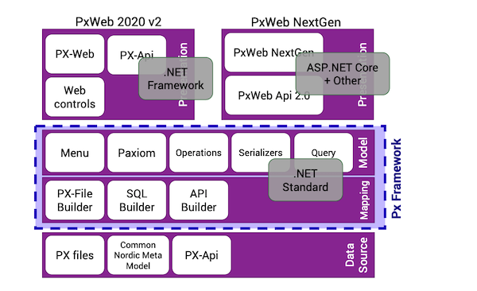

# Implementing Shared Statistical Services - Reuse Report

## 1. Introduction

### Reporting organization
Statistics Norway (SSB)
### Unit
702 IT-Architecture
### Report version
v0.0.1
### Report date
### Contact mail

## 2. Service reused

### Publisher
Statistics Sweden (SCB)
### Name
PxWeb
### Version
PxWeb 2019
### Main functionalities
### Links (code, documentation...)

* Souce code
   * https://github.com/statisticssweden/PxWeb
* Documentation
  * https://www.scb.se/en/services/statistical-programs-for-px-files/px-web/
*  Presentations at last PX meetings
   * 2020: https://www.scb.se/px-meeting-2020
   * 2019: https://www.scb.se/PxMeeting2019
   * 2018: https://www.scb.se/en/services/statistical-programs-for-px-files/px-web/international-px-meeting/

## 3. Service reuse

### Context
PxWeb comes from the PC-Axis

> "For the 1990 Swedish Population Census PC-Axis was developed"
> [PC-Axis Family Software - A Consortium for Dissemination of Statistics (2004)](https://www.nass.usda.gov/mexsai/Papers/pcaxisp.pdf)

Statistics Norway (SSB) has been using and contributing to PC-Axis for a long time. We were also was part of developing the Common Nordic Meta Model (CNMM) in early 2000.

In march 2001 we launched our public Statbank service. This was an Oracle database implementing CNMM and a webapplication written in Active Server Pages (ASP). The webapplication was based on the Statistics Denmarks Statbank.

Our Statbank has been a success ever since. After at complete rewrite of the ssb.no website in 2013 the Stabank is the only "channel" to disseminate tables/datasets.

Back in 2011 Statistics Sweden (SCB) developed the .Net version of PxWeb. The solution was split up in severel components and SSB contributed with a .Net implementation of the SQL connector to CNMM. The soruce code was hosted in subversion at Assembla.com

We also made our first pubic API for Statbank in 2013 based on some of these .Net components. But this API only exposed a small part of the Statbank.

However our Statbank struggled to keep up with technical debt and around 2014 we looked to do some upgrading and decided to make the switch to PxWeb.

### Business case
> Issue to address, problems with current solution (or lack of), etc.

- [x] Move the previous paragraphs to Context chapter?
- [x] Explain business case more, in SSB everybody has to disiminate throught the Statbank

In Statistics Norway we have a disimitation policy that says every table/dataset should be made availible in the Statbank. This requires that the statistical departments provide a minimum of metadata and it makes data easier to find knowing that everything is in the Statbank. On the other hand having a central/common(?) solutions like this demands smooth operation and no bottlenecks. 

We also like to provide as much as possible through public APIs as open data.

### Service reuse

#### General description
There were many reasons for us to choose PxWeb but these are some of the main ones.

##### Open source
Access to source code is essential. PxWeb was not open source at the time we started using it, but as we were a contributing party we already had access to the source code.

To depend on closed source when you have your own developers can be a drawback especially when the software in question has a relative small number of users. On the other hand a small number of users makes it easier to request new features.

Regardless we would probably not have chosen PxWeb without access to the source code. The need to customize beyond the excisting plugins and configurations options were to great.

Starting august 2019 PxWeb is completely open source at https://github.com/statisticssweden/PxWeb

#### Puplic API
PxWeb contains a standalone server called PxWebApi. This was very interesting for us since with this we could expose all the contents of our Statbank. PxWebApi supports custom queries several output formats.

...

#### Modern Tech
In 2014 PxWeb was still "modern tech" especially compared to our old  solution. Today ASP.NET Web Forms is not so modern, but all of the components the webapplication is depending on has in 2020 been ported to the conform to .NET Standard 2.0 and the next generation PxWeb and PxWebApi application are being developed.

#### Collaboration
As mentioned we already had close relations with the Nordics NSOs (NSIs?) from working with the CNMM and the .Net components. We also realised that

* it's very difficult to create a complete web solution from scratch when you have few developers
* it's much easier to build and customise something that already exists

There is also an annual "International PX meeting" (prev. Pc-Axis reference group meeting) that we attend.


Source: [Welcome presentation 2019](https://www.scb.se/contentassets/c6c00c769d874282a5188eace748820b/1-201909xx-welcome-asaarrhenscb.pdf)


In the meeting in Copenhagen 2014 we announced that we would switch to PxWeb.

From arround 2015 the Norwegian og Swedish developers have had weekly short Google Hangouts every friday. These meetings contain

* information sharing, what we are working on locally
* discussion of new features
* problem solving, eg. bugs, performance issues
* feedback from users on the forum

There has also been a few trips to in SCBs offices in Örebro and Stockholm and visits from SCB to our offices in Oslo and Kongsvinger.
Some of these meetings have been pure technical where we do big code merges.

To get most out out the collaboration the social element is key.

#### Launch
To play safe we split the launch in to parts
* PxWebApi was launched in May 2016 as a new application
* PxWeb was launched in January 2018 replacing our StatbankWeb


#### As-Is and To-Do architectures


Source: [PxWeb 2020 presentation](https://www.scb.se/globalassets/vara-tjanster/px-programmen/pxweb_2020v2_micke-petros.pdf)

- [ ] expand on this

#### Technical details
##### JSON-stat
One of our other contributions to PxWeb has been implementation of the  JSON-stat Dataset output format. I was the format we chose for our first api i 2013 and both JSON-stat v1.2 and 2.0 are available in PxWeb.

* https://json-stat.org/

In the future we like to improve this implementation with more metadata and also implement JSON-stat Collections

Example showing Consumer Price Index 12-month rate (per cent) as JSON-stat
```javascript
{
    "class": "dataset",
    "label": "03013: Consumer Price Index, by contents and month",
    "source": "Statistics Norway",
    "updated": "2020-08-10T06:00:00Z",
    "id": [
        "ContentsCode",
        "Tid"
    ],
    "size": [
        1,
        1
    ],
    "dimension": {
        "ContentsCode": {
            "label": "contents",
            "category": {
                "index": {
                    "Tolvmanedersendring": 0
                },
                "label": {
                    "Tolvmanedersendring": "12-month rate (per cent)"
                },
                "unit": {
                    "Tolvmanedersendring": {
                        "base": "per cent",
                        "decimals": 1
                    }
                }
            }
        },
        "Tid": {
            "label": "month",
            "category": {
                "index": {
                    "2020M07": 0
                },
                "label": {
                    "2020M07": "2020M07"
                }
            }
        }
    },
    "value": [
        1.3
    ],
    "role": {
        "time": [
            "Tid"
        ],
        "metric": [
            "ContentsCode"
        ]
    },
    "version": "2.0"
}
```


#### Organizational impact
> Integration of the service in the process flow.

#### Project management
#### Other aspects (e.g. financial)
#### Results achieved

- [ ] opensourcing - I3S facilitator for "speeding" the process
- [ ] plattform independent libraries

## 4. Lessons learned

### Problems encountered
- [ ] containerizing windows web applications
### Missing functionalities
### General feedback
- [ ] learning cloud and container technologies

## 5. Conclusions and next steps
